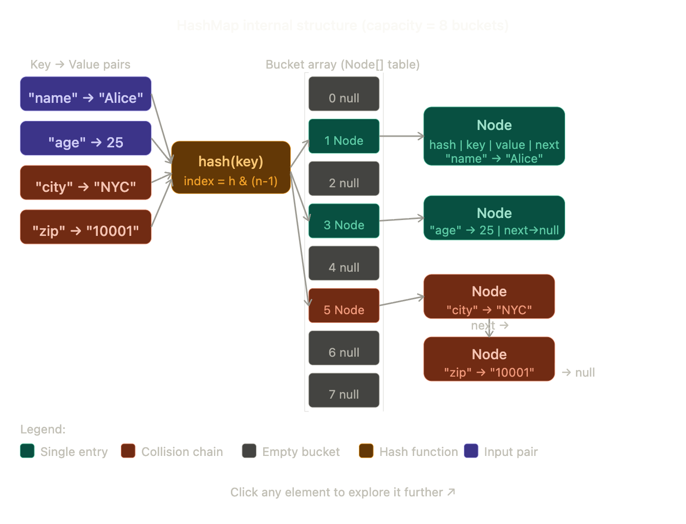
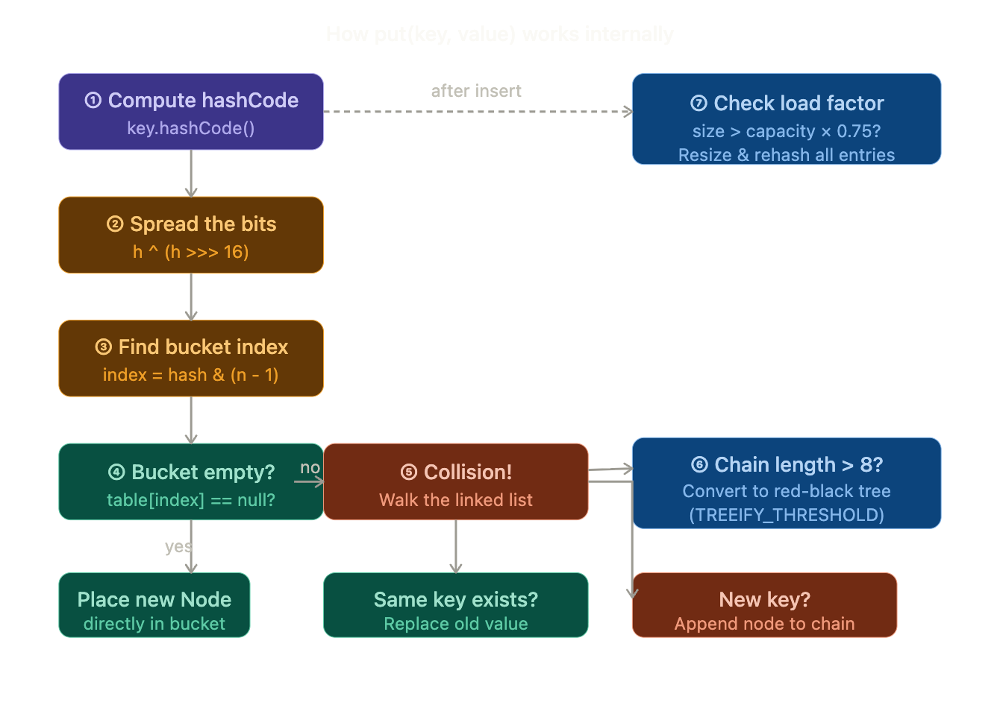
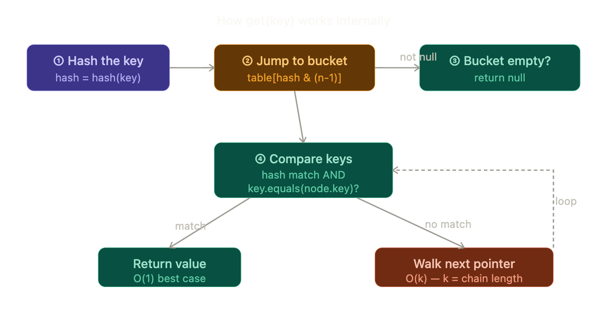
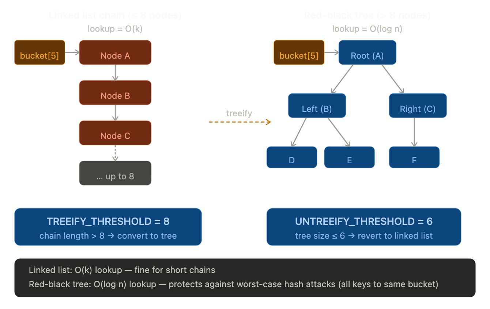
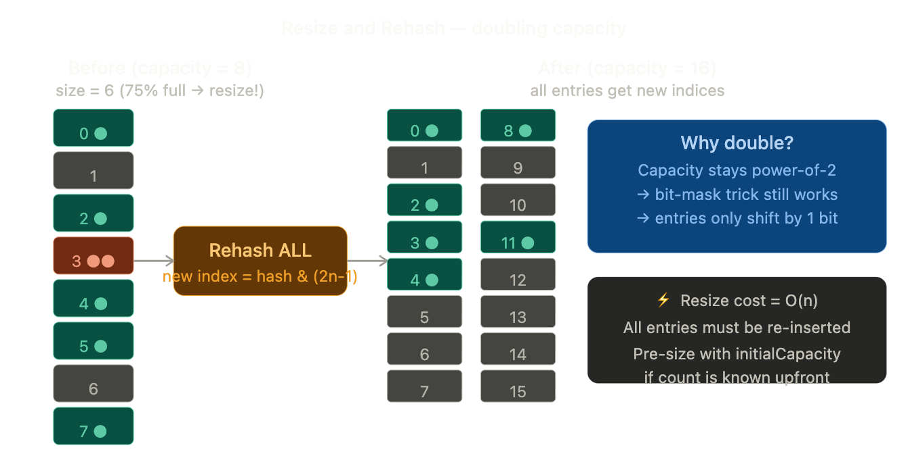
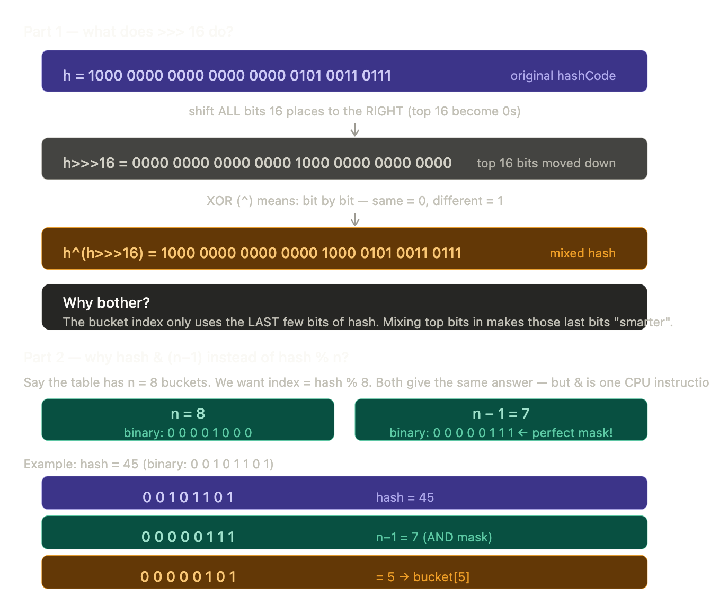

Let me build a rich interactive visual explainer for HashMap internals — step by step.Now let's go step by step through every internal mechanism.



---

## Step 1 — What is a HashMap?

A `HashMap<K, V>` stores key-value pairs. Internally it is a **plain Java array** (`Node[] table`) where each slot (called a **bucket**) can hold a linked list of nodes. The magic of constant-time `O(1)` lookup comes entirely from the hash function jumping directly to the right bucket instead of scanning everything.

---

## Step 2 — The Node structure

Every entry in a HashMap is wrapped in a `Node` object with four fields:

```java
static class Node<K, V> {
    final int hash;   // cached hash of the key
    final K key;
    V value;
    Node<K, V> next;  // pointer to the next node (for collision chains)
}
```

The `next` pointer is what enables **chaining** — multiple entries can live in the same bucket as a linked list.

---

## Step 3 — `put(key, value)` — step by stepHere is the actual Java source logic behind each step:



**① Compute hashCode**
```java
// Java calls key.hashCode() — defined on every Object
"name".hashCode()  // returns some large integer, e.g. 3373707
```

**② Spread the bits (perturbation)**
```java
// HashMap's internal static hash() method
static final int hash(Object key) {
    int h;
    return (key == null) ? 0 : (h = key.hashCode()) ^ (h >>> 16);
    // XOR the high 16 bits into the low 16 bits
    // This prevents collisions when n (capacity) is small
}
```

**③ Find the bucket index**
```java
// n = current table capacity (always a power of 2)
int index = hash & (n - 1);

// Example: hash = 0b...10110101, n = 16 (0b10000), n-1 = 0b01111
// index = 0b10110101 & 0b01111 = 0b0101 = 5
// This is just a FAST modulo operation (works only when n is power of 2)
```

> Why power of 2? Because `hash % n` is expensive, but `hash & (n-1)` is a single CPU instruction — identical result when n is a power of 2.

**④–⑤ Place or chain**
```java
if (table[index] == null) {
    table[index] = new Node<>(hash, key, value, null); // bucket was empty
} else {
    // Walk the chain — check if key already exists
    Node<K,V> e = table[index];
    while (e != null) {
        if (e.hash == hash && (e.key == key || key.equals(e.key))) {
            e.value = value; // Key found → update value
            return;
        }
        e = e.next;
    }
    // Key not found → append new Node at the end of chain
}
```

---

## Step 4 — `get(key)` — retrieving a value```java



```java
public V get(Object key) {
int hash = hash(key);
int index = hash & (n - 1);
Node<K,V> node = table[index];      // O(1) — direct array jump

    while (node != null) {
        // Must match BOTH hash AND equals — two-step check for safety
        if (node.hash == hash &&
            (node.key == key || key.equals(node.key))) {
            return node.value;          // Found!
        }
        node = node.next;               // Walk the chain
    }
    return null;                        // Not found
}
```

---

## Step 5 — Collision Handling (Chaining) and the Tree Upgrade



When a bucket's chain grows past **8 nodes**, Java converts it into a **red-black tree**. This is Java 8's big upgrade — it prevents a malicious hash-flooding attack (where someone deliberately crafts keys that all hash to the same bucket) from degrading performance to `O(n)`.

---

## Step 6 — Resize & Rehash

This is the most expensive operation in HashMap's lifecycle:

```java
// Default initial capacity
static final int DEFAULT_INITIAL_CAPACITY = 16;  // Must be power of 2

// Load factor threshold — resize when 75% full
static final float DEFAULT_LOAD_FACTOR = 0.75f;

// Resize triggers when:
// size > capacity * loadFactor
// e.g. 16 * 0.75 = 12 entries → triggers resize to 32 buckets
```
When resize fires, **every single entry** is re-hashed into the new table — this is `O(n)`. Because capacity doubles (power of 2), Java has a neat trick: each entry either stays at the same index or jumps exactly `oldCapacity` positions forward. No full re-hash needed — just a single bit check on the hash value.

---

## Step 7 — Key Rules & Common Pitfalls

```java
// ✅ Keys must implement hashCode() AND equals() consistently
// The contract: if a.equals(b) then a.hashCode() == b.hashCode()

// Example: custom key class
public class StudentKey {
    int id;
    String name;

    @Override
    public int hashCode() {
        return Objects.hash(id, name);   // use Objects.hash for safety
    }

    @Override
    public boolean equals(Object o) {
        if (this == o) return true;
        if (!(o instanceof StudentKey)) return false;
        StudentKey s = (StudentKey) o;
        return id == s.id && Objects.equals(name, s.name);
    }
}
```

> If you override `equals()` but forget `hashCode()`, two "equal" objects will land in **different buckets** and `get()` will never find the entry — a silent, painful bug.

---

## Complete Picture — All Key Numbers

| Constant | Value | Meaning |
|---|---|---|
| `DEFAULT_INITIAL_CAPACITY` | 16 | Starting number of buckets |
| `DEFAULT_LOAD_FACTOR` | 0.75 | Resize when 75% full |
| `TREEIFY_THRESHOLD` | 8 | Chain → red-black tree |
| `UNTREEIFY_THRESHOLD` | 6 | Tree → linked list (on removal) |
| `MIN_TREEIFY_CAPACITY` | 64 | Min table size for treeify to apply |

---

## Performance Summary

| Operation | Best case | Worst case (all keys collide) |
|---|---|---|
| `put()` | O(1) | O(log n) — tree |
| `get()` | O(1) | O(log n) — tree |
| `remove()` | O(1) | O(log n) — tree |
| Resize | — | O(n) — full rehash |

The O(1) average case is why HashMap is the go-to data structure for fast lookups. The entire trick is: **good hash function → entries spread evenly → buckets have 0 or 1 node → no chain walking needed**. 🔑

## Hash Explained
