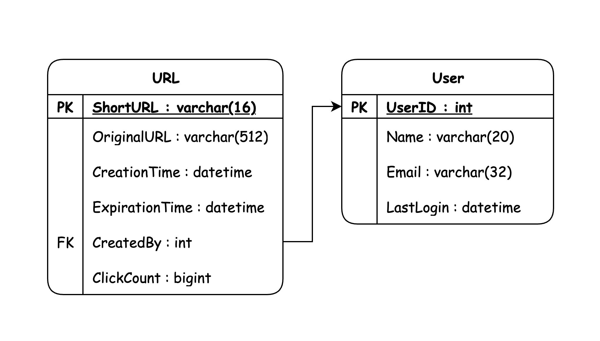
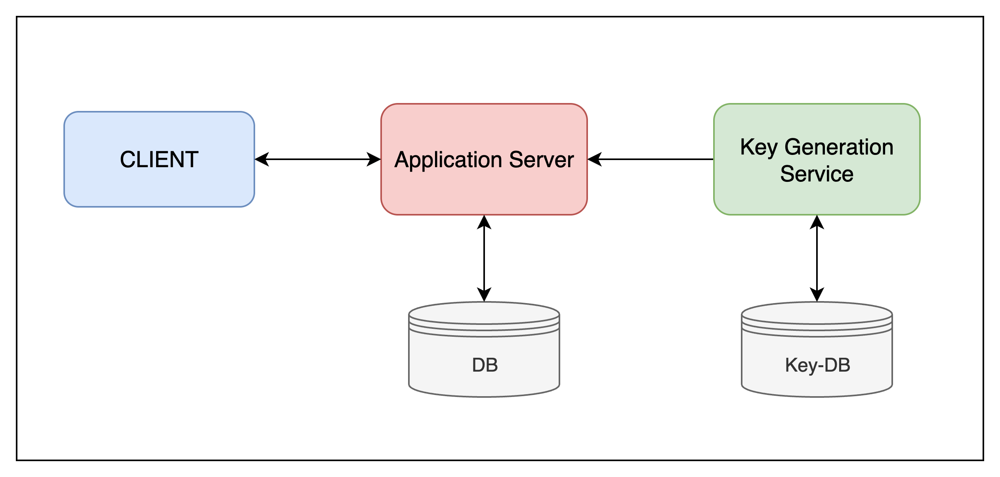
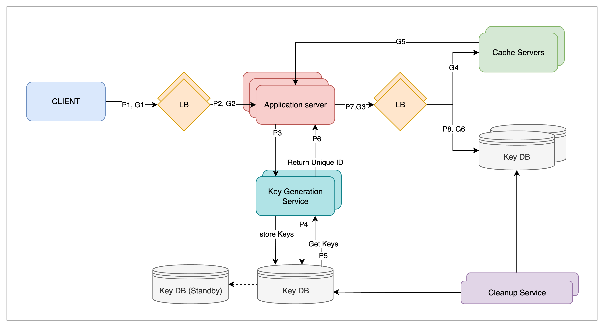

# **URL Shortener**

### 1. Requirements
**Functional Requirements**
- Given a url, generate shortened url
- When shortened url is called, system redirects to original url
- user to select custom aliases is possible
- links to expire after some time

**Non Functional Requirements**
- It is a read heavy system.
- High availability is required as all redirections will get affected if service is down
- URL Redirection at minimum latency

### 2. Capacity Estimation and Constraints
#### Traffic Estimate
Assumptions:
- Read heavy. Read:Write ratio = 100:1
- 100M(DAU) users doing an average of 5 url shortenings in a month.

Calculations:
- Total read in a month - 100M*5*100=50000M = 50B readRequests/month
- Total write per month = 100M*5 = 500M writeRequest/month
- Total write per second = 500M/(10^5*30) = 5000/30 ~ 167 writeRequests/second ~ 200 writeRequests/second
- Total read per second = 50B/(10^5*30) = 50*10^9/(10^5*30) = 50*10^4/30 ~ 16667 readRequests/second  ~ 20000 readRequests/second

#### Storage Estimate
Assumptions:
- To store for 5 year. Each object takes 500 bytes

Calculations 
- Storage for 1 month = 500M writes * 500 = 250000MB = 250 GB
- Storage for 5 year = 2.5GB * 12 * 5 = 60 * 250GB = 15000GB = 15TB

#### Bandwidth Estimate
- As we are getting 200 new URLs every second, 
  - Incoming Bandwidth = 200 write/s * 500bytes = 100000b/s = 100KB/s
  - Outgoing Bandwidth = 20k read/s * 500 bytes = 10000KB/s = 10MB/s

#### Cache Estimate
- How much data to cache in memory for effectively serving read operation reducing db hit frequency. Following 80-20 rule. 
- Means 20% traffic contributes 80% of traffic. Let's store 20% of read traffic in a day
  - Read traffic per day = 20000 reads/s * 10^5 ~ 2B reads/day
  - Cache storage = 2Breads/day * 500bytes * 20% = 1000GB * 20% ~ 200GB of cache required

### 3. APIs
- POST - /api/v1/createURL(api_dev_key, original_url, custom_alias=None, user_name=None,
  expire_date=None)
  - returns string(shortURL)
- DELETE - /api/v1/deleteURL(api_dev_key, url_key)
  - return "SUCCESS"
- GET - /shortURL
  - 302 redirect to original URL
  - (or) 404 not found

- A malicious user consumes all URL keys. To prevent abuse, we can limit users via their **api_dev_key**. Each
  api_dev_key can be limited to a certain number of URL creations and redirections per some time
  period

### 4. DB Design
- To store Trillions of record(almost TB)
- Each object is small almost <1K (~500bytes)
- Read heavy service
- No multiple/complex relationship b/w records

2 tables - URL Mappings and User 
- No SQL database to be used like **cassandra**, **dynamoDB**
  (Since we anticipate storing billions of rows, and we don’t
  need to use any multiple/complex relationships between objects)

###  5. Basic System Design and Algorithm
1. **Encoding actual URL**
- Compute a unique hash (e.g., MD5 or SHA256, etc.) of the given URL.
- Use Base62 ([a-z,0-9,A-Z]) or Base64 encoding ([a-z,0-9,A-Z,.,_])
- What is Length of short key? - 6, 8, 10
- Let's say we use Base 64 encoding,
  - if short key has 6 letters, we can generate 64^6 ~ 68.7B (<15T)
  - if short key has 7 letters, we can generate 64^7 ~ 4.3T (<15T)
  - if short key has 8 letters, we can generate 64^8 ~ 280T (>15T) [280, 000, 000, 000, 000]
- Now we can have Base 64 encoding to have 8 characters in the final output. But input to the Base64 encoder must be in the range between [1 to 280T(i.e)64^8].
- MD5 produces 128 bit hash value which is 2^128-1 ~ 3*10^38. It is going beyond our encoding range. And SHA256 produces 256 characters which is obviously not suitable.
- Let's say we have MD5 hash and trim the generated encoded value if it falls beyond 8 characters. It will end in key duplicacies.
- If multiple users use same URL, they get same short key by this system which is a flaw.
- We can append user_id to the URL, even after if we have conflicting keys we need to generate keys again and again

2. **Generating keys offline**
- We need 280T URLs, Input of range [1 to 280T]
- 280T ~ **2^48** ~ 2.8 *10^14
- So we need to have an unique ID generator of length 48 bits which generated unique ID like twitter snowflake using timestamp value
  - Twitter snowflake has (unsignedBit|TimeStamp|DataCenterID|MachineID|RunningSequence)
  - Or we can generate random 48 bit keys with only(unsignedBit|RunningSequence) in a Key Generation Service(KGS) and store it in a DB called Key-DB.
    - How to solve concurrency between DB fetch? Two calls cannot get same unique ID.
    - We can move the used query to another DB called used DB
    - KGS can be equipped to have some keys in in-memory deleting them from DB.
    - If KGS dies, it wouldn't be an issue as we have large pool of keys.
    - KGS synchronizes by getting locks or having synchronized blocks to prevent assigning same key to two servers
    - Key DB Size = 280T * (48/8)B = 280T*6B ~ 1680TB ~ 1.6PB (No. of total unique URLs * Total Character byte)
    - We can have standby KGS to avoid SPOF
  

### 6. Data Partitioning and Replication
- We need to horizontally scale our db to store trillions of record.
- **Range Based Partitioning**
  - We can store URLs in separate partitions based on the first letter of the
    URL or the hash key
  - Problem with this approach is that it can lead to unbalanced servers. we decide
    to put all URLs starting with letter ‘E’ into a DB partition, but later we realize that we have too many
    URLs that start with letter ‘E’
- **Hash-Based Partitioning**
  - We can take hash of the shortened url which is the key for partitioning and map it to the given number of partitions.
  - Still it will lead to collisions and bucket overloading
- **Consistent Hashing**
  - We can map all the hash of servers and keys on a virtual ring. Servers will take care of keys present in clockwise direction in the ring.
  - To avoid imbalancing, virtual nodes for each server are introduced.
  - Only (1/n)% of the keys needs to be remapped where n is the number of servers.
    - ex: n=4, (1/4)% =0.25%;   if k=4000, 0.25/100*4000=10 keys needs to be remapped.

### 7. Cache
- We can use cache to store frequently accessed urls to facilitate get call
- We can use some off-the-shelf solution like **Memcache**, which can store full URLs with their shortened ones.
- How much cache we should have?
  - Will start with 20% of daily traffic and go on further.
  - We need ~ 200 GB cache (Modern server can have 256 GB memory)
- Which cache eviction policy would best fit our needs?
  - Least Recently Used(LRU) can be used. We can discard an url which is not there for long time.
  - HashMap<String, String>  can be used to store shortenURL and original URL.
  - To further increase efficiency, we can use **cache replicas** and traffic can be load balanced across all servers
- How can each cache replica be updated?
  - Whenever there is a cache miss, DB is hit and cache is updated in all the replicas asynchronously. 

### 8. Load Balancer (LB)
- Load Balancers are need in 3 places
  - Client to App Servers
  - App servers to DB Servers
  - App servers to Cache Servers
- Initial Strategy - Round Robin
  - It equally routes the load to all servers. If a server fails, it got removed from the ring
  - Problem with this is, it does not take account of slow/overloaded servers.
- Efficient LB Strategy
  - Periodically poll the servers and get the health and traffic status and route the traffic accordingly.

### 9. Purging or DB cleanup
- Need to purge the expiring Links from DB as well as cache. We cannot actively clean it since it puts pressure on DBs. We will do passively through **lazy cleaning**.
- Different DB cleanup strategies. (All can be implemented)
  - When expired link is accessed, it can be removed from DB and returned null response.
  - A lightweight **Clean-Up service** can be scheduled to run.
  - Default expiration time of 2 years can be set if not provided
  - After removal, key can be put back in key-db. (But we are not storing the key!!!)

### Detailed Design

### 10. Telemetry
- Telemetry is the automatic collection, transmission, and analysis of data from remote sources.
- It is worth to note country of url and user location. How to store these statistics.
  - If it is part of a DB row that gets updated on each view, what will happen when a popular
    URL is slammed with a large number of concurrent requests?
    - We can use **an event stream + aggregation** strategy
    - We can have a separate analytics DB for the use case. **Redis** is excellent for high-concurrency counters. 
      - Client requests short URL.
      - Service returns the redirect immediately. 
      - Asynchronously Push {shortCode, timestamp, user IP, user Agent} to Kafka topic url-access-events. (User Agent-From where tinyUrl is accessed)
      - A consumer aggregates in memory or in a fast store (Redis). 
      - Periodically (e.g., every 30 minutes), flush aggregated counts to Cassandra in batch. (This is done to avoid frequent DB hits. Redis is very well suitable for counting operations. So for 30 minutes, if a URL got hit 5000 times. We need to make 5000 db calls for a single url if we avoid redis which can be reduced to 1 db update for every 30 min. Redis here behaves as a Aggregator)
      - Redis data will be cleared after a certain TTL

### Security and Permissions
- Can users create private URLs?
  - We can store permission level (public/private) with each URL in the database
  - We can also create a separate table to store UserIDs that have permission to see a specific URL. If a user is not permitted, we will throw **401 forbidden**.
    - Table has(userId, permittedURL, uniqueIDGenerated(PK))

