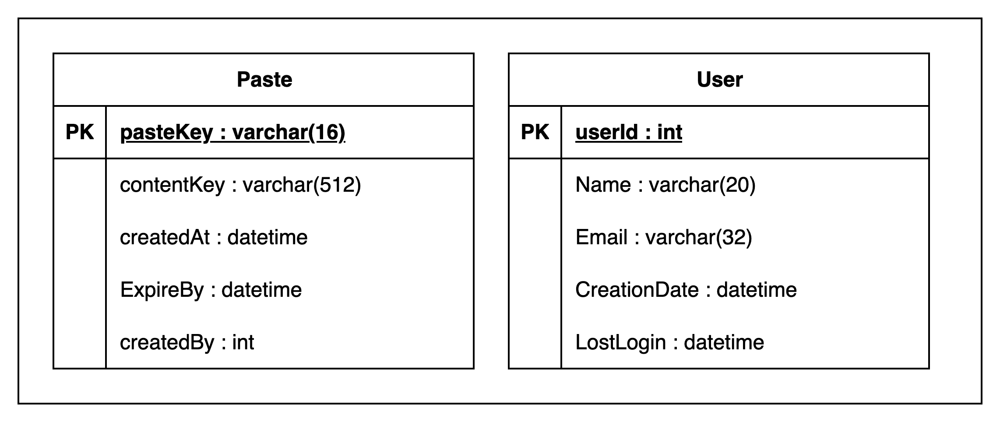
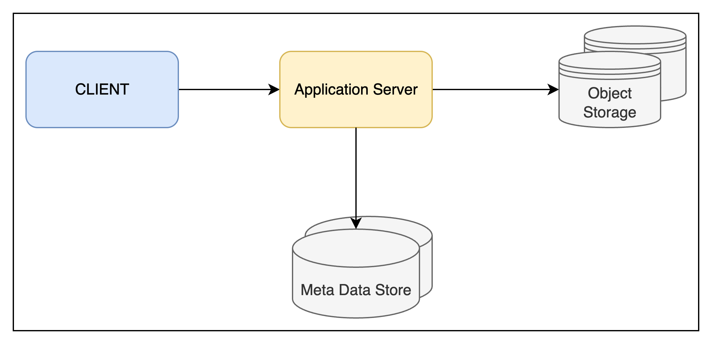
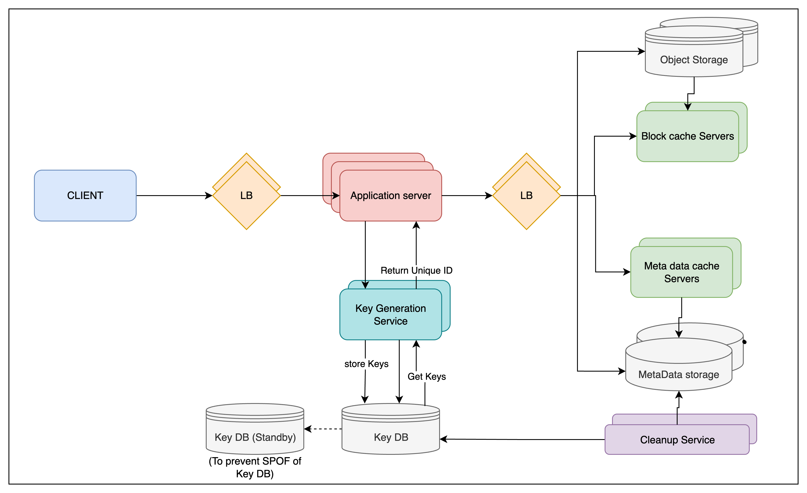

# PasteBin HLD

Users of the service will enter
a piece of text and get a randomly generated URL to access it.

### 1. Requirements

**Functional Requirements**
- Users should be able to upload or “paste” their data and get a unique URL to access it. 
- Users will only be able to upload text.
- Link expiration strategy
- To pick custom alias

**Non Functional Requirements**
- The system should be **_highly reliable_**, any data uploaded should not be lost. 
- The system should be **_highly available_**. This is required because if our service is down, users
   will not be able to access their Pastes. 
- Users should be able to access their Pastes in real-time with **_minimum latency_**. 
- Paste links should not be guessable (not predictable).

### 2. Design Considerations
- What should be the limit on the amount of text user can paste at a time?
  - restrict <10MB

### 3. Capacity Estimation and Constraints
- It is a **read-heavy** app. (Read:Write ratio => 5:1).

**Assumptions**
- 1M new paste requests/day
- Max 10MB of data upload. -> **Metadata** Avg would be **10KB** of data.

**Traffic Estimates (QPS)**
- Write traffic per second => 1M/10^5=10pastes/sec
- Read traffic per second => 50 reads/s

**Storage Estimates**
- Data storage for a day=> 1M/day * 10KB = 10GB/day
- Data storage for 10 years => 10GB*365*10=36500GB ~ 36.5TB
- To store generated links, 
  - Total URLs generated for 10years = 1M pastes/day * 365*10 ~ 3650M ~ **3.65B** pastes for 10 years
  - If we use Base 64 encoding, 64^6~68.7B. So we can very well fix for **6 characters** in the output url.
  - 1 character takes 1 bytes(UTF-8). [Since we are gonna only use a-z,A-Z,0-9,.,_]
  - Total storage of links => 3.65 (requests/ten yrs) * 6B = 18.90GB ~ **20GB**
  - 20GB is very negligible compared to 36.5TB.
- To keep some margin, we will assume a 70% capacity model(meaning we don’t want to use more than 70% of our total storage capacity at any point)
  - 36.5TB*(30/100) = 10.95TBto be added extra (Adding some idle storage)
  - 36.5+10.95 ~ **47.45TB**

**Bandwidth estimates**
- Total Incoming bandwidth per second = 10pastes/sec * 10KB = 100KB/s (100KB of **ingress** per second)
- Total Outgoing bandwidth per second = 50reads/s * 10KB = 500KB/s (**egress**)

**Memory estimates**
- To cache 20% of daily traffic of reads
  - Total memory of cacahe server = 5M reads/day * (20/100) * 10KB = 10MB*1KB ~ **10GB**

### 4. API
- POST - /api/v1/createURL(api_dev_key, paste_data, custom_url=None, user_name=None,
  expire_date=None)
    - returns .html page with pasteText
- DELETE - /api/v1/deleteURL(api_dev_key, api_paste_key)
    - return "SUCCESS"/"FAILURE"
- GET - /api_paste_key
    - return .html page with pasteText

### 5. Database Design
- To store Trillions of record(almost TB)
- Each metadata object is small almost <1K (~100bytes)
- Each paste object is of few MB
- Read heavy service
- No relationship b/w records

- ‘pasteKey’ is the URL equivalent of the TinyURL 
- ‘ContentKey’ is the **object key** storing the contents of the paste.

### 6. High Level Design

- App server servers read and write request
- Separate storage layer to store metadata and pasteObject
  - Metadata can be stored in no-sql DB like **cassandra**. Since there is no relation b/w data.
  - Paste contents in some object storage (like **Amazon S3**).

### 7. Component Design

- **Application Server**
  - Write Request : For a paste request, paste content and metadata is sent to store in cassandra and Amazon S3(Simple Storage Service).
  - Now for this request we need to generate a shortened URL.
  - For that we can use **Key Generation Service**
    - We need 3.6B URLs, Input of range [1 to 280T]
    - 3.6B ~ **2^32** ~ 4.2 *10^9
    - So we need to have an unique ID generator of length 32 bits which generated unique ID like twitter snowflake using timestamp value
        - Twitter snowflake has (unsignedBit|TimeStamp|DataCenterID|MachineID|RunningSequence)
        - Or we can generate random **32 bit** keys with only(unsignedBit|RunningSequence) in a Key Generation Service(KGS) and store it in a DB called Key-DB.
            - How to solve concurrency between DB fetch? Two calls cannot get same unique ID.
            - We can move the used query to another DB called used DB
            - KGS can be equipped to have some keys in in-memory deleting them from DB.
            - If KGS dies, it wouldn't be an issue as we have large pool of keys.
            - KGS synchronizes by getting locks or having synchronized blocks to prevent assigning same key to two servers
            - Key DB Size = 3.6B * 6 ~ 21.6GB (No. of total unique URLs * Total Character byte)
            - We can have standby KGS to avoid SPOF
          
### 8. Data Partitioning and Replication
 - Same as URLShortener

### 9. Cache
- Same as URLShortener
- We will be having extra block cache for object storage for easy access

### 8. Load Balancer (LB)
- Same as URLShortener
- Loadbalancer will be required for block storage as well

### 9. Purging or DB cleanup
- Same as URLShortener

### 10. Telemetry
- We can use timestamp, user IP, user Agent for analytics

**Detailed Design**

