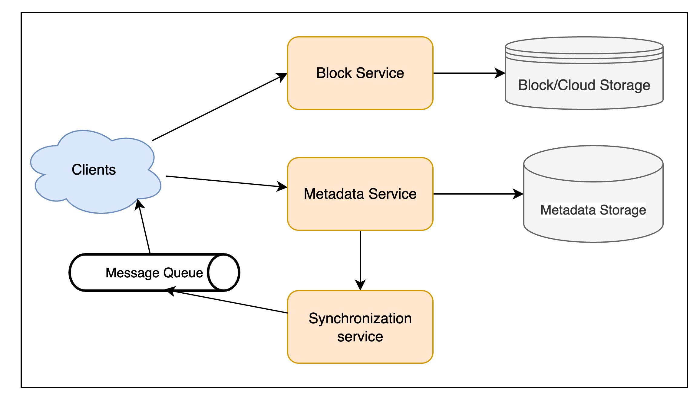
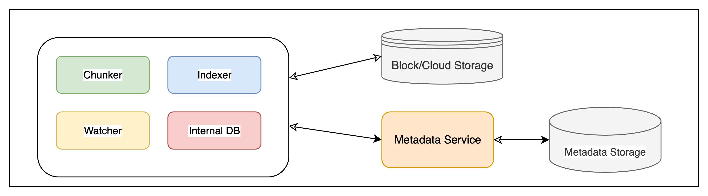
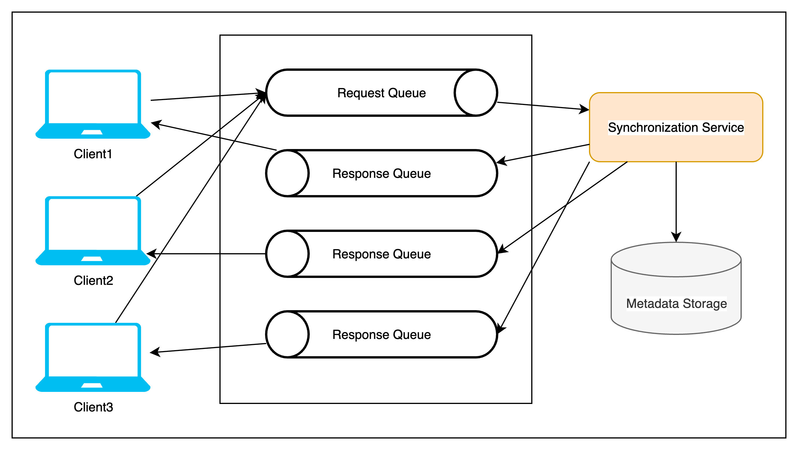
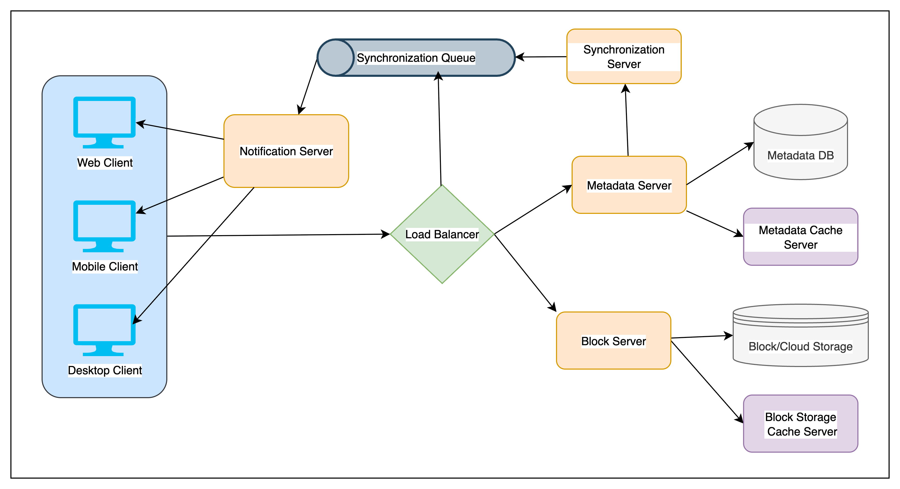

# Dropbox

## 🎯 Why Design Dropbox (Cloud Storage System)?

### ✅ Real-World Motivation

* Users want **anywhere, anytime access** to files across devices.
* Cloud storage like Dropbox enables:

    * **Availability** (via internet)
    * **Durability** (no data loss)
    * **Scalability** (storage on-demand)

> 📌 Think: Sync between devices, offline editing, version history, and shared access.

---

## 📋 1. Functional & Non-Functional Requirements

### 🔧 Functional

1. Upload/download files from any device
2. Share files/folders with other users
3. Automatic sync across devices
4. Handle **large files** (up to 1GB)
5. Support **offline editing** → sync when online
6. **Versioning/Snapshotting** of files

### 🧱 Non-Functional

* Strong **ACID properties**
* **High reliability** (data loss not acceptable)
* **Low latency sync** and update detection
* **Efficient bandwidth usage**

---

## 🧠 2. Design Considerations

| Category             | Details                                            |
| -------------------- | -------------------------------------------------- |
| **Concurrency**      | High read & write volume                           |
| **Sync granularity** | Use **chunks** (e.g. 4MB) instead of full files    |
| **Fault-tolerance**  | Retry only failed chunks                           |
| **Efficiency**       | Transfer only modified chunks (diff-based updates) |
| **Deduplication**    | Avoid uploading same content multiple times        |
| **Local cache**      | Store file metadata on the client for speed        |
| **Offline support**  | Maintain change log → sync when online             |

> 📌 Interview Tip: **Chunking + Metadata + Diff Uploads** = Key to scalable Dropbox.

---

## 📏 3. Capacity Estimation (Estimation Questions Are Common!)

| Metric                   | Assumption               |
| ------------------------ | ------------------------ |
| Total Users              | 500M                     |
| Daily Active Users (DAU) | 100M                     |
| Avg Devices/User         | 3                        |
| Files/User               | 200                      |
| Total Files              | 500M × 200 = 100B        |
| Avg File Size            | 100KB                    |
| Total Storage            | 100B × 100KB = **10 PB** |
| Active Connections       | 1M/minute (\~17K/sec)    |

> 📌 Highlight how you'd handle **scale and sync performance under load.**

---

## 🧠 What to Emphasize in an Interview

### 📦 Storage

* Store files in **chunks**
* Maintain **versioned metadata**
* Use **hashing** (SHA-256 or similar) for deduplication

### 🔄 Sync

* Client watches file system → logs changes
* Changes sent as **diffs or chunk updates**
* Use **timestamp/versioning** to resolve conflicts

### 🛠️ Fault Tolerance

* Replicate data across **data centers**
* Retry failed chunks
* Support **rollback/version restore**

### ⚡ Performance

* **CDN for downloads**
* Background upload/download manager on clients
* Reduce write amplification by **only syncing changed data**

---

## 🗣️ Sample Interview Response

> “Dropbox is a cloud file storage system enabling cross-device sync and collaboration.
> Files are chunked for efficient storage and updates, with deduplication to save space.
> We maintain metadata separately, use versioning for snapshot recovery, and enable offline sync by queueing changes.
> The system needs to support strong consistency and be resilient to client-side failures, while scaling to handle millions of users and petabytes of data.”

---

## 🧠 Flashcard Format (Quick Revision)

| ❓ Question                          | ✅ Answer                     |
| ----------------------------------- | ---------------------------- |
| Avg file size in Dropbox?           | 100KB                        |
| How is sync optimized?              | Chunking + Diff updates      |
| Offline editing support?            | Yes, with local change queue |
| Total file volume estimated?        | 100 billion                  |
| Storage scale?                      | 10 Petabytes                 |
| Key properties required?            | ACID                         |
| What helps avoid duplicate uploads? | Content-based hashing        |

---

## ✅ Problem Statement

Allow users to sync a workspace folder across devices with automatic upload, download, and change propagation. Changes on one device (create/update/delete) should reflect on all connected devices in near real-time.

---

## 5️⃣ High-Level Design

### 🔧 Core Requirement

* Users specify a **workspace folder**.
* Files placed/modified/deleted in this folder get **synced** to the cloud and across devices.
* Sync includes both **file content** and **metadata** (name, size, timestamp, sharing info).

### 🧩 Key Design Components

* **Clients**: Detect changes, sync content + metadata, and listen for updates.
* **Metadata Servers**: Store metadata (file info, versions, etc.) in a structured DB.
* **Block Storage**: Stores file content in **chunked** format.
* **Sync Service**: Manages versioning and propagates changes.
* **Message Queues**: Enables asynchronous and scalable communication.

---

## 6️⃣ Component Design

### a. 🖥️ Client

Monitors local workspace, syncs files/chunks, manages local metadata, and handles conflict resolution.

**Key Subcomponents:**

1. **Internal Metadata DB**: Local cache of file/chunk info for offline access.
2. **Chunker**: Splits files into 4MB chunks (optimizable), detects diffs using hashes.
3. **Watcher**: Monitors file system changes, listens to server notifications.
4. **Indexer**: Updates internal metadata, triggers upload/download via Sync Service.

**Key Considerations:**

* Use **chunking + hash-based diff** to save bandwidth.
* Store metadata locally for speed + offline support.
* Use **HTTP Long Polling** or **WebSockets** to get near real-time updates.
* **Exponential backoff** for retries on slow/unavailable servers.
* Mobile clients may sync only on demand to save battery/data.

---

### b. 🗃️ Metadata Database

Stores structured metadata about:

* Files and their versions
* Chunks and checksums
* Users
* Devices
* Workspaces (sync folders)

**DB Options:**

* **Relational DB (MySQL)**: Simpler consistency using built-in ACID.
* **NoSQL (DynamoDB, Cassandra)**: More scalable, but require app-level consistency logic.

---

### c. 🔁 Synchronization Service

Central logic hub for:

* Validating changes with metadata DB.
* Broadcasting changes to subscribed devices.
* Handling versioning and consistency.
* Running **differencing algorithms** to reduce data transfer.

**Optimization:**

* Transmit only changed chunks using hash comparison.
* Deduplicate chunks with identical hashes, even across users.

**Scaling Tip:**

* Use multiple Sync Service instances pulling from a **global request queue**.

---

### d. 📩 Message Queue Service

Enables loose coupling and high throughput.

**Two Types of Queues:**

1. **Request Queue** (shared/global): Clients post changes here.
2. **Response Queues** (per-client): Sync Service posts updates to these.

Helps avoid polling overload and supports **push model** for updates.

---

### e. ☁️ Cloud/Block Storage

* Stores only file chunks (content).
* Clients interact **directly** with it.
* Decouples storage from metadata for flexibility and modular scaling.

---

## 🧠 Interview Highlights (Cheat Sheet)

| Aspect            | Key Design                                                        |
| ----------------- | ----------------------------------------------------------------- |
| File Sync         | Workspace folder monitored, changes synced                        |
| Optimization      | Chunking (4MB), hash diffs, deduplication                         |
| Real-time Updates | Long polling / WebSockets + Response Queues                       |
| DB Choice         | RDBMS for simplicity, NoSQL for scale (with tradeoffs)            |
| Sync Consistency  | Sync Service ensures consistency and versioning                   |
| Offline Mode      | Clients use local metadata DB                                     |
| Messaging         | Async Request/Response queues using middleware (Kafka, SQS, etc.) |
| Conflict Handling | Client-side + server-side conflict resolution                     |
| Mobile Clients    | On-demand sync to conserve resources                              |

---

## 🔄 7. File Processing Workflow

When **Client A** updates a shared file:

### 🔁 Sequence:

1. **Client A uploads** updated chunks directly to Cloud Storage (using pre-signed URLs).
2. **Client A sends metadata update** to Sync Service (e.g., chunk hashes, version).
3. **Sync Service updates** Metadata DB and pushes notifications to Clients B & C.
4. **Clients B & C** receive notification (via their response queues) and download only changed chunks.

📌 **Offline Clients**: Updates are held in their **individual response queues** until they come online.

---

## 📦 8. Data Deduplication

### Goal: Avoid storing and transferring duplicate chunks across users or versions.

### 🔹 a. Post-Process Deduplication

* Store all chunks first → Dedup later via background jobs.
* ✅ No client wait time
* ❌ Wastes temporary storage + network bandwidth

### 🔹 b. In-Line Deduplication (**Preferred**)

* Client/Synchronization Service calculates chunk hash **before upload**
* If identical chunk exists (based on hash), we **reuse** it
* ✅ Saves bandwidth and storage instantly
* ❌ Slower client-side uploads due to real-time hashing

---

## 🗂️ 9. Metadata Partitioning

Needed to scale Metadata DB for billions of files/chunks.

### 🔸 1. **Vertical Partitioning**

* Split by feature: user tables on one DB, file/chunk on another
* ✅ Simple
* ❌ Not scalable for huge tables; cross-DB joins are expensive

### 🔸 2. **Range-Based Partitioning**

* Partition by file path prefix (e.g., all "A\*" in one DB)
* ✅ Predictable
* ❌ Can lead to **skew** if one prefix dominates

### 🔸 3. **Hash-Based Partitioning** (**Preferred**)

* Hash `FileID` → partition
* ✅ Balanced distribution
* ❌ Still possible skew → fix with **Consistent Hashing**

---

## ⚡ 10. Caching

### 🔹 a. Block Storage Cache

* Use **Memcached** or similar to cache hot chunks by their hash
* Block servers check cache before cloud storage
* ✅ Faster I/O for popular files

### 🔹 b. Metadata Cache

* Cache frequent metadata (e.g., chunk-to-file mappings) near Sync Service
* ✅ Reduces Metadata DB load

🔁 **Eviction Policy**: Use **LRU (Least Recently Used)** to discard cold chunks

---

## 🧰 11. Load Balancing (LB)

To handle **high client traffic**, place LBs in front of:

### 1. **Block Servers**

### 2. **Metadata Servers**

### 🔹 a. Round Robin (Basic)

* ✅ Simple and effective
* ❌ Ignores actual server load

### 🔹 b. Smart LB (Preferred for scale)

* Uses **health checks + server load metrics**
* ✅ Dynamically adjusts traffic
* ✅ Removes dead/slow nodes from rotation

---

## 🔐 12. Security, Permissions & File Sharing

### 🔹 File Access Control

* Metadata DB stores **permissions per file**

  * Owner
  * Shared users
  * Public/Private flags

### 🔹 Client Authorization

* Clients get **pre-signed URLs** from Sync Service for storage access
* Only authorized users/devices can upload/download

### 🔹 Encryption (Implied best practice)

* **Data-at-Rest**: Encrypt chunks in Cloud Storage
* **Data-in-Transit**: Use HTTPS for all communication

---

## 🧠 Interview Summary Sheet

| Topic            | Key Insight                                                 |
| ---------------- | ----------------------------------------------------------- |
| File Update Flow | Chunk upload → Metadata update → Notification to clients    |
| Deduplication    | Use in-line dedup with hash comparison (preferably SHA-256) |
| Metadata Scaling | Hash-based partitioning + Consistent Hashing                |
| Caching          | Cache chunks (block-level) & metadata using LRU             |
| Load Balancing   | Round-robin initially, move to load-aware LB                |
| Security         | Use permission tables, pre-signed URLs, encryption          |

---
