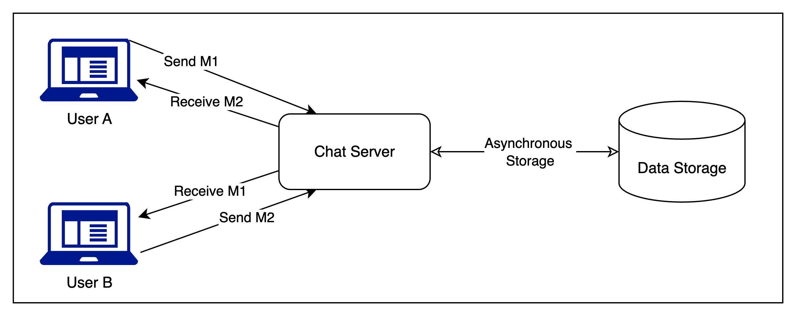
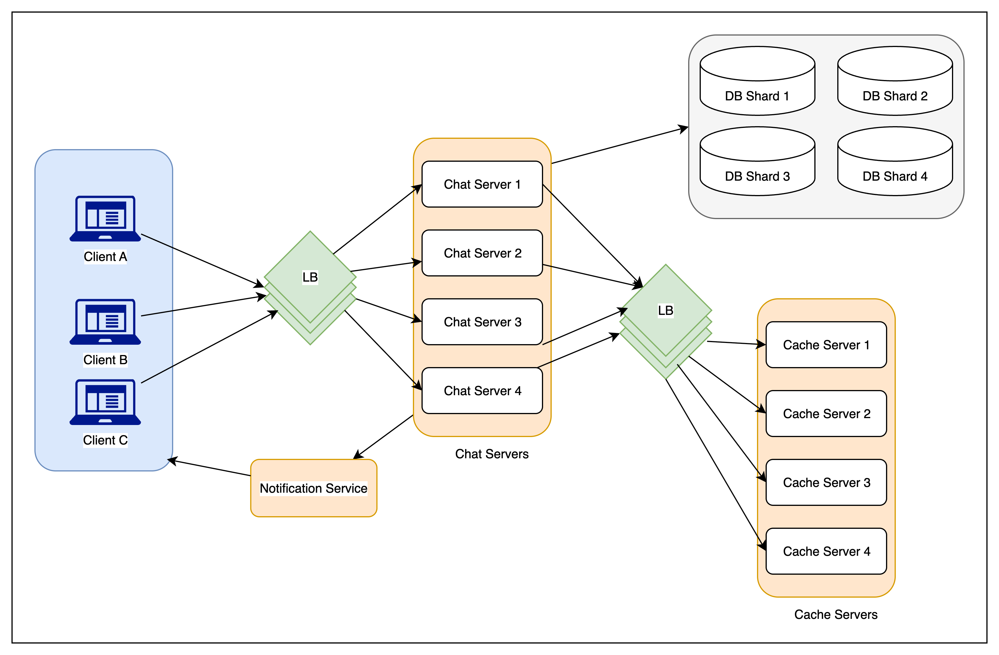

# Facebook Messenger

## ✅ Facebook Messenger – System Design Overview

---

## 1️⃣ **What is Facebook Messenger?**

A real-time **instant messaging app** for **text communication** between users on **web & mobile**, supporting:

* One-on-one messaging
* Group chats
* Message history
* Push notifications

---

## 2️⃣ **Core Requirements**

#### ✅ **Functional Requirements**

* One-on-one **text messaging**
* Track **user online/offline status**
* **Persist** message history (for sync across devices)

#### 🚀 **Extended Requirements**

* **Group chats** (multi-user messaging)
* **Push notifications** (offline alerts)

#### 🛠 **Non-Functional Requirements**

* **Real-time** messaging (low latency)
* **Strong consistency** (same chat across devices)
* **High availability** (optional trade-off with consistency)

---

## 3️⃣ **Capacity Estimation (Back-of-the-Envelope)**

#### 📊 User Activity

* **500M daily active users**
* **40 messages/user/day** → **20B messages/day**

#### 💾 Storage Estimation

* 1 msg ≈ **100 bytes**
* **Daily**: 20B \* 100Bytes = **2 TB/day**
* **5 years**: 2 TB/day \* 365 \* 5 = **3.6 PB**

(Excludes metadata, user info, replication, compression)

#### 🌐 Bandwidth Estimation

* **Incoming**: 2TB/day ≈ **25 MB/s**
* **Outgoing**: Also **25 MB/s** (every sent message is delivered to someone)

---

### 🔁 High-Level Numbers Summary

| Metric             | Value      |
| ------------------ | ---------- |
| Total messages/day | 20 Billion |
| Storage/day        | 2 TB       |
| Storage (5 years)  | 3.6 PB     |
| Incoming bandwidth | 25 MB/s    |
| Outgoing bandwidth | 25 MB/s    |

---

Here’s a **hydrated, clear, and interview-friendly version** of the **High-Level Design** for Facebook Messenger’s messaging flow. This version keeps the technical details sharp while being easy to revise quickly:

---

## 🏗️ 4. High-Level Design – Facebook Messenger

### 🎯 **Objective**

Design a system where users can **send and receive real-time messages**, with reliable delivery and message persistence.

---

### 🧩 Key Component: **Chat Server**

* Acts as the **central coordinator** for all message exchanges
* Responsibilities:

    * Accept messages from sender
    * **Route** them to receiver
    * **Store** them for history/syncing
    * Handle **acknowledgments** for reliability

---

### 🔁 **End-to-End Messaging Workflow**

Let’s break down the complete lifecycle of sending a message:

#### Step-by-step:

1. **User-A** types a message and sends it through an **open connection** (WebSocket or Long Poll) to the **Chat Server**

2. The **Chat Server**:

    * Accepts the message
    * Sends an immediate **ACK** to User-A (to confirm receipt)

3. The server:

    * **Stores** the message in the **database** (asynchronously, to avoid blocking)
    * **Forwards** the message to **User-B**, if they are online (via their open connection)

4. **User-B** receives the message and sends a **delivery acknowledgment** back to the server

5. The server then **notifies User-A** that the message has been successfully **delivered to User-B**

---

### 🧠 Reliability & UX Impact

| Event                         | Purpose                                           |
| ----------------------------- | ------------------------------------------------- |
| ACK to sender after receiving | Ensures sender doesn’t resend due to network drop |
| Async DB storage              | Avoids delaying delivery due to disk I/O          |
| Final delivery ACK            | Helps update UI with "Delivered" tick ✔️          |

---

### 📝 Interview Talking Point

You can say:

> The Chat Server plays a central role — it not only ensures messages are routed to the correct receiver but also handles persistence and delivery guarantees through a structured ACK flow. We optimize for **low latency** and **user feedback** without sacrificing **reliability**.



---

## 🧩 5. Detailed Component Design – Facebook Messenger

We’ll break it into three core areas:

1. **Message Handling**
2. **Message Storage**
3. **User Presence**

---

### 🔹 A. Message Handling

#### 🎯 Goal:

Ensure **reliable, low-latency, real-time messaging** between users with **minimal delivery delay** and **accurate ordering**.

---

### 📬 1. Receiving and Delivering Messages

#### How do clients communicate with the server?

**Two main models:**

| Model      | Description                                                  | Pros                | Cons                                     |
| ---------- | ------------------------------------------------------------ | ------------------- | ---------------------------------------- |
| **Pull**   | Client periodically polls server for new messages            | Simple to implement | High latency, wasteful (empty responses) |
| ✅ **Push** | Client keeps an **open connection** (WebSocket/Long Polling) | Real-time delivery  | Slightly more complex infra              |

➡️ **Push model is preferred** for Messenger due to:

* **Instant delivery**
* **Low latency**
* Reduced resource wastage (no polling noise)

---

### 🔗 2. Maintaining Open Connections

#### ✅ Technologies:

* **WebSocket** (full-duplex, low overhead)
* **HTTP Long Polling** (backup/older devices)

#### How does Long Polling work?

* Client sends a request to server, which **holds** it open
* Server replies only when new message is available
* Client **immediately reissues** a new request after response
* If timeout/disconnect happens, client reconnects

---

### 🧠 3. Connection Management

#### How does server know which user is connected and where?

* Use an **in-memory map/hash table**:

  ```text
  HashMap<UserID, ConnectionObject>
  ```
* Allows server to:

    * Quickly **look up** user connection
    * **Route** messages instantly

#### 🔁 When user is offline:

* Server can:

    * ❌ Return "delivery failed" to sender
    * ✅ Ask sender to retry (client logic handles auto-resend)
    * ✅ Optionally **store and retry** when user reconnects

---

### 📈 4. Scaling Chat Servers

#### Assumption:

* Each server supports **\~50K concurrent connections**
* For **500M active users**, we need:

  ```
  500,000,000 / 50,000 = 10,000 servers
  ```

#### 🔄 Load Balancing:

* Use a **software load balancer** (or service registry) to:

    * Map `UserID → Correct server`
    * Route connection and message delivery properly

---

### ✉️ 5. Message Delivery Flow

Let’s walk through the **exact steps** of delivering a message:

1. **Sender sends** a message via open connection to **Chat Server A**
2. Server A:

    * ✅ **Acknowledges** receipt to sender
    * 🔄 **Looks up** which server holds receiver's connection (Chat Server B)
    * ➡️ **Routes** message to Chat Server B
3. Chat Server B delivers to **receiver** (User-B)
4. User-B sends **delivery ACK**
5. Server notifies User-A that **delivery was successful**
6. In parallel, message is **stored asynchronously in DB**

---

### ⏳ 6. Message Ordering

#### ❗ Problem with relying only on timestamps:

Two users may send messages **almost simultaneously**, and server timestamps may vary slightly, e.g.:

```text
User-1 sends M1 → Received at T1
User-2 sends M2 → Received at T2 (T2 > T1)
```

If M2 reaches User-1 before M1 is seen by User-2, ordering becomes inconsistent across clients.

#### ✅ Solution: **Per-user sequence numbers**

* Each message has a **unique incremental sequence number per conversation per user**
* Guarantees **ordering is consistent for that user across all their devices**
* Doesn’t force global order, which is unnecessary and hard to scale

| User   | View    | Order           |
| ------ | ------- | --------------- |
| User-1 | M1 → M2 | Consistent      |
| User-2 | M2 → M1 | Also consistent |

> Think of this as **local logical ordering**, not global physical ordering

---

### 📋 Quick Recap: Message Handling Design Summary

| Feature          | Approach                             | Why                          |
| ---------------- | ------------------------------------ | ---------------------------- |
| Communication    | Push (WebSocket/Long Polling)        | Real-time, low latency       |
| Routing          | HashMap of UserID → Connection       | Fast message delivery        |
| Scaling          | 10K chat servers + load balancer     | Handles 500M connections     |
| Message Delivery | ACK → Route → Deliver → ACK          | Reliable experience          |
| Ordering         | Per-user sequence numbers            | Local consistency per client |
| Offline Handling | Auto-retry, fail response, or buffer | Flexible recovery            |

---
Here is a **hydrated, structured, and interview-friendly summary** of the **“Storing and Retrieving Messages”** section of Facebook Messenger’s system design.

This section focuses on **data durability, performance, and scale**, which are crucial for chat systems that handle **billions of messages daily**.

---

## 🗄️ 5b. Storing and Retrieving Messages – Detailed Design

---

### 🎯 Goal:

Design a **high-throughput**, **low-latency**, and **reliable** message persistence layer that:

* Handles **massive message volumes**
* Supports **sequential reads** for chat histories
* Ensures **message durability** and **eventual consistency**

---

### 🔁 1. Message Persistence Strategy

### ✅ Two Options to Store Incoming Messages:

| Option                      | Description                          | Trade-offs                                                |
| --------------------------- | ------------------------------------ | --------------------------------------------------------- |
| 🧵 **Separate Thread**      | Spin off a new thread to write to DB | Simple, but can overwhelm thread pool under heavy load    |
| 📨 **Asynchronous Request** | Use async/non-blocking I/O           | Preferred in scalable systems; better resource efficiency |

➡️ **Best practice:** Use an **async producer-consumer queue** (like Kafka or in-memory queue) and delegate DB writes to a **worker pool** or **background service**.

---

### ⚙️ 2. Design Considerations

To support the async DB write pipeline:

### 🧩 Key Factors to Handle:

1. **Connection Pooling** – Efficient use of DB connections to avoid exhaustion
2. **Retry Mechanism** – In case of transient failures (e.g., network blips)
3. **Dead-letter Logging** – Store logs of failed write attempts (after multiple retries)
4. **Replay Mechanism** – Background job periodically retries failed logs

> 💡 This design ensures **durability and recoverability** without blocking the message delivery path.

---

### 🧬 3. Database Selection

### ❌ What **not to use**:

* **Traditional RDBMS (MySQL)**:

    * Good for relational queries, but not designed for high write throughput or range scans on massive unstructured data
* **Document stores (MongoDB)**:

    * Doesn’t scale well for workloads with **frequent, small-sized writes**

---

### ✅ Recommended: **Wide-Column Store (e.g., HBase)**

#### 🔍 Why HBase?

| Feature                    | Benefit                                                               |
| -------------------------- | --------------------------------------------------------------------- |
| **High write throughput**  | Excellent for chat’s firehose of small messages                       |
| **Range scans**            | Ideal for reading message history in order                            |
| **Columnar model**         | Supports storing multiple versions of a message per key               |
| **Runs on HDFS**           | Durable, scalable, and distributed                                    |
| **Modeled after BigTable** | Proven for real-time messaging at scale (e.g., Gmail, WhatsApp infra) |

---

### 📦 HBase Message Schema (Example)

| Row Key (UserID\_ConversationID) | Column Family: `msg`              | Columns: timestamp/message |
| -------------------------------- | --------------------------------- | -------------------------- |
| `user1_chat2`                    | `msg:2024-07-15T12:01:00Z` → "Hi" | …                          |

> ✅ This allows **range queries**, e.g., *"Give me the last 50 messages between user1 and chat2."*

---

### 📲 4. Message Retrieval (Client-Side)

### 🧾 How should clients fetch chat history?

**Use Pagination:**

* Clients **request a window** of messages, not all at once
* Pagination is usually based on:

    * `timestamp` or
    * `sequence number` or
    * `message ID range`

#### Why?

| Client Type | Page Size   | Rationale                       |
| ----------- | ----------- | ------------------------------- |
| 📱 Mobile   | 20–30 msgs  | Small screen, limited bandwidth |
| 💻 Desktop  | 50–100 msgs | Larger screen, faster network   |

➡️ Load messages **lazily**, e.g., when the user scrolls up (infinite scroll UX)

---

### 🛠️ Design Pattern for Efficient Fetching:

* **Backend API** should expose endpoints like:

  ```
  GET /conversations/:id/messages?before=timestamp&pageSize=50
  ```
* Backend fetches from HBase using **range scans on row keys**
* Applies **rate limiting** and **authorization** per user

---

### 🚀 Recap: Message Storage Design Summary

| Category         | Choice                                         | Why                                         |
| ---------------- | ---------------------------------------------- | ------------------------------------------- |
| Writing Strategy | Async + Retry + Logging                        | Durable and efficient                       |
| Storage DB       | ✅ HBase (wide-column)                          | High write throughput, supports range reads |
| Failure Handling | Retry queue + dead-letter log + replayer       | Ensures eventual durability                 |
| Read Pattern     | Paginated fetch, lazy loading                  | Scales to billions of messages              |
| Data Model       | Row = Conversation, Columns = Timestamped Msgs | Enables fast sequential reads               |

---


## 5C - 🔵 Component: User Presence Management (Online/Offline Status)

### 🎯 **Goal**

Efficiently **track and communicate** user presence (online/offline) to **relevant users** without overwhelming the system.

---

### 💡 Why is it challenging?

* **500M+ active users** = Massive scale
* If we **broadcast every status change** (e.g., every "User X is now online") to all friends instantly →
  ❌ Unsustainable load on server & network

---

### 🧠 Core Insight

✅ Since each online user maintains an **open connection** (WebSocket or Long Poll), the server inherently knows who's online.

So, the challenge isn't **tracking**, but **efficiently sharing** this info with others.

---

### ⚙️ Optimized Presence Handling – Key Techniques

#### 1️⃣ **App Launch: Initial Bulk Pull**

* When user opens the app:

    * Client sends request:
      *"Give me the current status of all my friends."*
    * Server responds with **snapshot of statuses**
    * ✅ Reduces real-time tracking load

#### 2️⃣ **Message-to-Offline Detection**

* If **User A** sends a message to **User B**, and **B is offline**:

    * Server:

        * ❌ Fails delivery
        * ✅ Notifies User A
    * Client updates **status of User B = offline**
    * ✅ Saves from broadcasting offline status constantly

#### 3️⃣ **Online Status Broadcast with Delay**

* When a user connects:

    * Server **delays broadcast** (e.g., 5–10 seconds)
    * Why? Users may come online for a brief moment (network drops, refreshes)
    * ✅ Reduces “status flapping”

#### 4️⃣ **Viewport-Aware Status Pulling**

* Clients often display a **subset of friends** (e.g., top 5 in viewport)
* Client periodically pulls **only the visible users' statuses**

    * ✅ Reduces load
    * ❗ Some staleness is acceptable (e.g., if friend just went offline)

#### 5️⃣ **Chat Initiation Check**

* When starting a **new conversation**, client:

    * Pulls status of target user **on-demand**
    * ✅ Ensures up-to-date info without periodic checks

---

### 📝 Summary Table

| Optimization                       | When it happens               | What it saves                       |
| ---------------------------------- | ----------------------------- | ----------------------------------- |
| Initial status pull                | On app start                  | Avoids tracking all friends live    |
| Message delivery failure detection | On sending to an offline user | No need for pre-checks              |
| Delayed status broadcast           | On new connection             | Reduces false-positive flaps        |
| Viewport-based pulling             | When users are in view (UI)   | Avoids unnecessary full-list checks |
| On-demand fetch on new chat start  | When opening new DM           | Saves tracking everyone always      |

---

### 🧠 Interview Tip

If asked *“how would you reduce load while maintaining presence accuracy?”*, explain:

> We **don’t need real-time accuracy for all friends**. By combining **delayed updates**, **on-demand checks**, and **lazy pulling**, we strike a balance between **user experience** and **system scalability**.

---

## 🧩 6. Data Partitioning – Facebook Messenger

### 🎯 Goal:

Efficiently store and retrieve **petabytes of chat data** across distributed storage systems, while enabling **fast read access** to chat history.

---

## 📦 Storage Scale

* Expected storage: **3.6 Petabytes (PB)** for 5 years
* If one DB shard = **4TB**, then:

  ```
  3.6PB / 4TB ≈ 900 shards
  ```

---

## 🔑 Partitioning Strategy

### ✅ **Primary: Hash-based Partitioning by `UserID`**

#### Why?

| Reason                     | Explanation                                                  |
| -------------------------- | ------------------------------------------------------------ |
| ✅ **Locality of data**     | All of a user's messages are on the same shard               |
| ✅ **Fast reads**           | Chat history queries are mostly per-user or per-conversation |
| ✅ **Uniform distribution** | Hashing avoids hotspots and balances load across shards      |
| ✅ **Sharding scalability** | Easy to scale with new users                                 |

#### Shard Calculation:

```
shardNumber = hash(UserID) % 1000
```

* We predefine **1000 logical shards**
* Even if only a few physical servers exist initially, we can map multiple logical shards to each server

---

### 🔁 Logical vs Physical Partitioning

#### 🔧 Initial Setup:

* Start with **few physical DB servers**
* Each server stores **multiple logical partitions (shards)**

#### 🛠️ As system grows:

* Add more physical servers
* **Reassign logical shards** to new physical hosts using **consistent hashing** or shard rebalancing

> 💡 Hashing abstracts away the physical server from the application logic — making the system **scalable and transparent**.

---

### ❌ Alternative: Partitioning by `MessageID`

| Why it’s a bad idea                                   |
| ----------------------------------------------------- |
| ❌ Spreads a single user’s messages across many shards |
| ❌ Range queries (chat history) become **very slow**   |
| ❌ Adds complexity in fetching ordered messages        |

> ⚠️ Use-case violation: Messaging apps **almost always query by conversation/user**, not by individual message ID.

---

## 📌 Summary Table

| Aspect               | Value                                                      |
| -------------------- | ---------------------------------------------------------- |
| Total Storage Needed | 3.6 PB for 5 years                                         |
| Shard Size           | 4 TB                                                       |
| Total Shards         | \~900 (rounded to 1000 for simplicity)                     |
| Partition Key        | `UserID` (hash-based)                                      |
| Shard Mapping        | `hash(UserID) % 1000`                                      |
| Initial Deployment   | Fewer physical servers, multiple logical shards per server |
| Scale-Up Strategy    | Add physical servers, remap shards                         |
| Avoided Strategy     | Partitioning by `MessageID` (due to read inefficiency)     |

---

## 🗣️ Interview Talking Point

You can say:

> To ensure scalability and fast retrieval of chat history, we use a **hash-based partitioning scheme on `UserID`**. This way, all messages for a user go to the same shard, allowing efficient range queries. We separate **logical shards** from **physical servers** so that we can scale storage transparently by reassigning shards when needed.

## 🔄 7. Caching – Speeding Up Chat Access

### 🎯 Goal:

Reduce latency and database load for frequent or recent conversations.

### 💡 Strategy:

* **Cache the latest N messages** (e.g., last 15) from the **last M conversations** (e.g., last 5) shown in the user’s viewport.
* This supports instant access to recent messages when opening Messenger or scrolling chat lists.

### 📍 Design Choice:

* Since a user’s messages are all stored on one shard, **cache for a user can also reside on a single server**, simplifying cache consistency and access.

### ✅ Benefits:

| Feature              | Why It Helps                          |
| -------------------- | ------------------------------------- |
| Caching last 5 chats | 80%+ of usage comes from recent chats |
| Avoid DB hits        | Reduces pressure on the main database |
| Co-located cache     | Local to the DB shard = low latency   |

---

## ⚖️ 8. Load Balancing – Routing User Traffic

### 🧩 Components to Load Balance:

1. **Chat Servers** (handling live WebSocket/TCP connections)
2. **Cache Servers**

### 🧠 Strategy:

* Use **consistent hashing on `UserID`** to route the request to the appropriate chat server.
* This keeps **user-session affinity**, ensuring all messages from/to a user land on the **same chat server**.
* For cache servers, similarly **map `UserID` to a cache node**, reducing lookups and cache misses.

### 🔁 Chat Server Affinity:

```
chatServer = hash(UserID) % totalServers
```

> This ensures that the same user always connects to the same backend unless a server crashes.

---

## 🔐 9. Fault Tolerance & Replication – Ensuring Reliability

### 🚨 Chat Server Failure

#### 🔴 Problem:

* Chat servers maintain **active TCP/WebSocket connections**.
* **TCP connections cannot be failed over** to another server easily.

#### ✅ Solution:

* Let the **client handle reconnection** logic.
* On failure, the client will automatically **reconnect to another healthy server** (possibly assigned by a load balancer).

### 🧠 Redundancy for Message Data

| Question                                        | Design Decision                                    |
| ----------------------------------------------- | -------------------------------------------------- |
| Can we have only one copy of a user's messages? | ❌ No, that risks permanent data loss               |
| Solution?                                       | ✅ Store **multiple copies** (e.g., 3 replicas)     |
| Advanced Option                                 | Reed-Solomon encoding for **efficient redundancy** |

#### ✅ Implementation Options:

* Use **replication across HBase regions**
* Or apply **erasure coding (Reed-Solomon)** for storage-efficient backups

> 🔁 All writes should go to the **primary + replicas** to ensure consistency and recoverability.

---

## 🗣️ Interview Soundbites

You can say:

> For performance, we cache recent messages of active conversations in memory, colocated with the user’s DB shard. For reliability, we replicate message data across nodes and let clients reconnect to chat servers after failure, since TCP failover is hard. Load balancing is done via consistent hashing on `UserID` to maintain session stickiness.

---



## 🔧 10. Extended Requirements – Advanced Use Cases

---

### 🫂 a. Group Chat Support

#### 🧠 Core Idea:

* Use a **GroupChat object** identified by a unique `GroupChatID`.
* Each group chat maintains a **member list** of participants and lives on a **specific chat server**.

#### 🛠️ Architecture:

* When a message is sent to a group:

    * Load balancer uses `GroupChatID` to route the message to the correct chat server.
    * That server **iterates over all group members**, finds their respective chat connections (via UserID → Chat Server mapping), and sends the message.

#### 🧩 Storage Strategy:

* Group chat metadata is stored in a **separate database table**.
* Partitioning is done by `GroupChatID` for fast access and scalability.

#### ✅ Design Benefits:

| Feature              | Why It Helps                            |
| -------------------- | --------------------------------------- |
| Group-based routing  | Avoids centralized bottlenecks          |
| Distributed delivery | Parallel push to each user's connection |
| Partitioned storage  | Efficient lookup and growth             |

> 🗣️ In interviews, mention that each chat server only needs to know the users it is responsible for and forward group messages to relevant servers.

---

### 📲 b. Push Notifications for Offline Users

#### 🚫 Problem:

* In the original design, **messages to offline users fail**, which is not ideal in real-world usage.

#### ✅ Solution: Add Push Notification Support

#### 🔄 Workflow:

1. **Client Opt-In**:

    * Devices register for push notifications via manufacturer services (e.g., **APNs**, **FCM**).

2. **Notification Server**:

    * A new internal component is introduced.
    * Responsible for:

        * Detecting when a recipient is offline
        * Formatting the notification payload
        * Forwarding it to the manufacturer’s push service

3. **Manufacturer Service**:

    * Handles the final **push to the user’s device** using tokens provided by the client app.

#### 🔒 Persistence Note:

* You may still **persist the actual message in DB**, and just push a notification like:

  > “You have a new message from Alex”
* This avoids sending sensitive content via push, respects security policies.

---

### 🧠 Design Considerations:

| Concern                         | Approach                                   |
| ------------------------------- | ------------------------------------------ |
| Device-specific APIs            | Integrate with APNs, FCM, etc.             |
| Offline awareness               | Server should maintain user presence       |
| Failure to deliver push         | Retry logic, TTL, or fallback to SMS/email |
| Notification server scalability | Stateless, horizontally scalable service   |

---

## 💬 Interview Soundbites

You can say:

> For group chats, we route messages based on `GroupChatID` and deliver to all active participants by checking their connected chat server. To support offline messaging, we added a Notification Server that pushes messages via FCM or APNs when the recipient is offline. Group chat metadata and messages are partitioned by `GroupChatID` for efficient storage and lookup.

