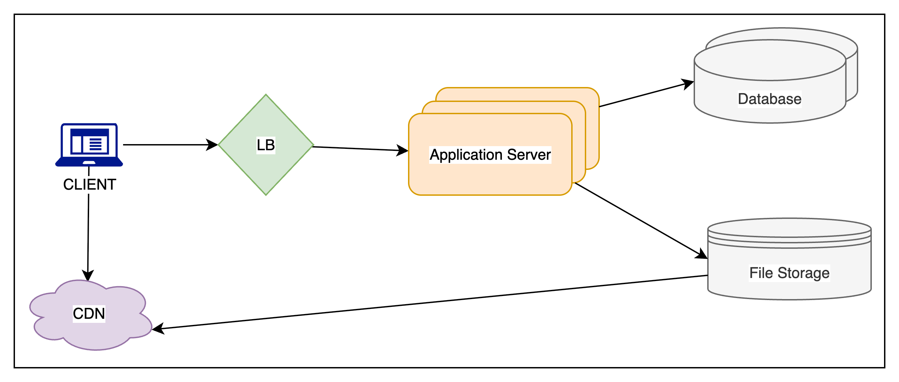

# Twitter

## 🐦 1. What is Twitter?

**Twitter** is a **microblogging** platform where users can share short, real-time updates called **tweets** (initially limited to 140 characters, now 280+). It supports a global feed of updates, with multimedia support (photos, videos), hashtags, and trends.

* **Access Methods**: Web interface, mobile app, SMS
* **Core Identity**: Real-time, public conversation and broadcast model

---

## 🎯 2. Requirements and Goals of the System

### ✅ Functional Requirements

| Requirement            | Description                                         |
| ---------------------- | --------------------------------------------------- |
| 1. Post Tweets         | Users can post new tweets with text/media           |
| 2. Follow Users        | One-way following; followers get tweets in timeline |
| 3. Favorite Tweets     | Users can "like" tweets                             |
| 4. Timeline Generation | Personalized timeline of tweets from followed users |
| 5. Multimedia Support  | Tweets may include photos and videos                |

> The system emphasizes **real-time content** and **social graph-based discovery**.

---

### 🚀 Non-Functional Requirements

| Requirement                   | Design Implication                                                 |
| ----------------------------- | ------------------------------------------------------------------ |
| 1. High Availability          | Must handle high traffic and regional failures gracefully          |
| 2. Timeline Latency ≤ 200ms   | Requires fast reads, possibly pre-computation or caching           |
| 3. Eventual Consistency is OK | Timeline can be slightly stale, but the system must stay available |

> This aligns with the **CAP theorem**: favors **availability** over **strict consistency**.

---

### 🔄 Extended Requirements

These add complexity and richness to user interaction:

| Feature              | Explanation                                         |
| -------------------- | --------------------------------------------------- |
| 🔍 Search            | Full-text or hashtag-based tweet lookup             |
| 💬 Reply to Tweets   | Threaded conversations (comment system)             |
| 📈 Trending Topics   | Calculate hot hashtags/topics over time windows     |
| 🏷️ Tag Users        | Mention users with @username                        |
| 🔔 Notifications     | For mentions, replies, likes, follows, etc.         |
| 👥 Suggested Follows | Graph-based suggestions based on mutual follows     |
| 📸 Moments           | Curated tweet collections (like stories/highlights) |

> These features require **analytics, ML**, and **indexing layers** (e.g., Elasticsearch for search, graphs for suggestions).

---

## 📏 3. Capacity Estimation & Constraints

---

### 👥 **User Base Assumptions**

| Metric                   | Value       |
| ------------------------ | ----------- |
| Total Registered Users   | 1 Billion   |
| Daily Active Users (DAU) | 200 Million |
| Avg Followees per User   | 200         |
| Tweets Generated Per Day | 100 Million |

---

### ⭐ **User Interaction Volume**

#### a. **Favorites per Day**

* 🧮 `200M users * 5 favorites = 1B favorites/day`

#### b. **Tweet Views per Day**

* Timeline Visits: `2` personal timeline + `5` other users’ pages
* Tweets per Page View: `20`
* 🧮 `200M * (2+5) * 20 = 28B tweet views/day`

#### c. **Total Data Transfer Rate (Text + Media):**

* 💡 Overall Estimate: **\~35GB/sec**

---

### 💾 **Storage Estimation**

#### a. **Text-Only Tweet Storage**

* Tweet size = `140 chars * 2 bytes = 280 bytes`
* Metadata = `~30 bytes`
* Total per tweet ≈ **310 bytes**
* 🧮 `100M * 310B = ~30GB/day`

#### b. **Media Storage**

Assumptions:

* Every 5th tweet has a photo (\~200KB)

* Every 10th tweet has a video (\~2MB)

* 🧮 Photos: `100M/5 * 200KB = 4TB/day`

* 🧮 Videos: `100M/10 * 2MB = 20TB/day`

> ✅ **Total Media Storage**: **24TB/day**

#### c. **5-Year Data Retention**

* **Tweets only**: `30GB/day * 365 * 5 = ~55TB`
* **Media**: `24TB/day * 365 * 5 = ~43.8PB`

> ⚠️ **Long-term media storage is the real scale driver**.

---

### 🌐 **Bandwidth Estimates**

#### a. **Ingress (Upload to Twitter)**

* Primarily media ingestion: **\~24TB/day**
* 🧮 `24TB / 86400s ≈ 290MB/s ingress bandwidth`

#### b. **Egress (Tweet Viewing)**

Users view 28B tweets/day, and:

* Every tweet has text
* Every 5th tweet has a photo (and it's always viewed)
* Every 10th tweet has a video (watched every 3rd time)

**Breakdown:**

| Component | Formula                         | Result       |
| --------- | ------------------------------- | ------------ |
| Text      | `(28B * 280 bytes) / 86400s`    | **\~93MB/s** |
| Photos    | `(28B / 5 * 200KB) / 86400s`    | **\~13GB/s** |
| Videos    | `(28B / 10 / 3 * 2MB) / 86400s` | **\~22GB/s** |

> ✅ **Total Egress Bandwidth**: **\~35GB/s**

---

### 📌 Key Takeaways for Design

* **Tweet volume** is manageable (\~30GB/day for text), but **media** drives system scale (\~24TB/day).
* **Timeline reads** and **media serving** require heavy bandwidth optimization and CDNs.
* **Latency requirements (200ms)** require **pre-computed timelines**, **caching**, and **smart partitioning**.
* High **ingress/egress** bandwidth justifies use of **object stores** for media (e.g., S3) and **cache layers/CDNs** for distribution.

---
Here’s a **hydrated and system-design-friendly summary** of the **System APIs** section, specifically focused on the **Tweet Posting API** and **broader architectural considerations** around it:

---

## 🔌 4. System APIs – Posting a Tweet

### 🧭 **Design Principle**

Twitter exposes **RESTful APIs** (SOAP is outdated for modern web services) to allow external clients (e.g., mobile apps, web apps, 3rd-party devs) to interact with core functionalities.

---

### ✅ **Tweet Posting API – Specification**

**Endpoint:**

```
POST /api/v1/tweet
```

---

### 🧾 **Request Parameters**

| Field                       | Type       | Description                                                                       |
| --------------------------- | ---------- | --------------------------------------------------------------------------------- |
| `api_dev_key`               | `string`   | Developer’s API key for **authentication**, **throttling**, and **rate-limiting** |
| `tweet_data`                | `string`   | Actual tweet text (up to 140 characters)                                          |
| `tweet_location`            | `string`   | Optional — The location the tweet is about (e.g., event place)                    |
| `user_location`             | `string`   | Optional — Location of the user when posting (for personalization/trending)       |
| `media_ids`                 | `number[]` | Optional — Pre-uploaded media (images, videos) to be linked                       |
| `maximum_results_to_return` | `int`      | Unclear in original context; could be deprecated or misused here                  |

---

### 📤 **Response**

```json
{
  "status": "success",
  "tweet_url": "https://twitter.com/{username}/status/{tweet_id}"
}
```

* Or return an appropriate `HTTP error` with status codes like:

    * `401 Unauthorized` (Invalid `api_dev_key`)
    * `429 Too Many Requests` (Rate limit exceeded)
    * `400 Bad Request` (Invalid payload)

---

### 📌 API Design Considerations

* **Rate Limiting**: Throttle abusive users via `api_dev_key` to prevent spam or DDoS.
* **Statelessness**: REST APIs are stateless. All context must come with the request.
* **Media Uploading**: Handled by a **separate media upload API**, which returns `media_id`s that are linked during tweet post.
* **Security**: Ensure that only authenticated users can post, with access control on media resources.
* **Audit/Moderation Hooks**: Tweets may go through async abuse or spam filters.
* **Idempotency**: Clients can optionally send idempotency keys to avoid duplicate tweet creation.

---

Here’s a **hydrated, interview-friendly summary** of the **High-Level System Design for Twitter**, with reasoning, clear terminology, and component breakdown tailored for system design interviews:

---

## 🏗️ 5. High-Level System Design – Twitter

---

### 🎯 **Goal**

Design a highly available, **read-heavy** social platform capable of:

* **\~100M tweets/day** (\~1.2K tweets/sec)
* **\~28B reads/day** (\~325K reads/sec average, 1M+ at peak)

---

### ⚖️ **Traffic Pattern**

| Metric               | Value                         |
| -------------------- | ----------------------------- |
| Write-heavy?         | ❌ No (\~1.2K writes/sec)      |
| Read-heavy?          | ✅ Yes (\~325K reads/sec)      |
| Media upload needed? | ✅ (24TB/day)                  |
| Latency goal         | <= 200ms for timeline queries |



---

## 🗃️ **6. Relational Data Model**

### 📄 1. `User` Table

Stores basic information about each registered user.

| Column         | Type          | Description                    |
| -------------- | ------------- | ------------------------------ |
| `UserID`       | `INT` (PK)    | Unique user identifier         |
| `Name`         | `VARCHAR(20)` | Display name of the user       |
| `Email`        | `VARCHAR(32)` | Unique email for login/contact |
| `DateOfBirth`  | `DATETIME`    | User’s date of birth           |
| `CreationDate` | `DATETIME`    | When account was created       |
| `LastLogin`    | `DATETIME`    | Last login timestamp           |

---

### 🐦 2. `Tweet` Table

Stores each tweet's text content, metadata, and location.

| Column           | Type             | Description                            |
| ---------------- | ---------------- | -------------------------------------- |
| `TweetID`        | `INT` (PK)       | Unique identifier for each tweet       |
| `UserID`         | `INT` (FK)       | Author of the tweet                    |
| `Content`        | `VARCHAR(140)`   | Text content of the tweet              |
| `TweetLongitude` | `INT` (nullable) | Optional location tagged in tweet      |
| `UserLongitude`  | `INT` (nullable) | User's location at time of posting     |
| `CreationDate`   | `DATETIME`       | When the tweet was created             |
| `NumFavorites`   | `INT`            | (Optional, can be derived) Total likes |

> Note: You can denormalize `NumFavorites` for fast access, or compute it using aggregation.

---

### ❤️ 3. `Favorite` Table

Tracks which users favorited which tweets.

| Column         | Type           | Description                  |
| -------------- | -------------- | ---------------------------- |
| `UserID`       | `INT` (PK, FK) | The user who liked a tweet   |
| `TweetID`      | `INT` (PK, FK) | The tweet that was liked     |
| `CreationDate` | `DATETIME`     | When the tweet was favorited |

> Composite Primary Key: (`UserID`, `TweetID`)
> Use an index on `TweetID` for reverse lookup (who liked a tweet).

---

### 👥 4. `UserFollow` Table

Tracks "following" relationships between users.

| Column       | Type           | Description                     |
| ------------ | -------------- | ------------------------------- |
| `FollowerID` | `INT` (PK, FK) | The user who follows someone    |
| `FolloweeID` | `INT` (PK, FK) | The user being followed         |
| `CreatedAt`  | `DATETIME`     | When the follow action occurred |

> Composite Primary Key: (`FollowerID`, `FolloweeID`)
> To find all followers or followees quickly, index both columns.

---

### Optional: 📸 `Media` Table (if tweets can contain media)

| Column      | Type                      | Description                          |
| ----------- | ------------------------- | ------------------------------------ |
| `MediaID`   | `INT` (PK)                | Unique ID for media                  |
| `TweetID`   | `INT` (FK)                | Tweet that this media is attached to |
| `Type`      | `ENUM` (`photo`, `video`) | Type of media                        |
| `URL`       | `VARCHAR`                 | Link to the CDN resource             |
| `CreatedAt` | `DATETIME`                | Upload time                          |

---

## 🔧 Relationships Summary

* One `User` → many `Tweets`
* One `User` → many `Favorites` (liked tweets)
* Many-to-many: `User` ↔ `User` (via `UserFollow`)
* One `Tweet` ↔ many `Favorites`
* One `Tweet` ↔ many `Media` (optional)

---

## 🔀 7. Data Sharding in Twitter-like System

Due to **huge tweet volume (100M/day)** and **extremely high read load (28B views/day)**, we must **shard data** across multiple database servers to scale efficiently and prevent hotspots.

---

### 🧭 **Option 1: Sharding by `UserID`**

**Idea:**

* Store *all data of a single user* (tweets, follows, favorites) on a specific shard based on a hash of `UserID`.

**✅ Pros:**

* Fast to fetch **all data related to a user**.
* Simple lookup using consistent hashing or user-to-shard mapping.

**❌ Cons:**

1. **Hot User Problem**:

  * Celebrities or influencers (e.g., Elon Musk) can overload one shard with massive read/write traffic.
2. **Skewed Data Growth**:

  * Some users may tweet heavily or follow thousands, leading to **data imbalance** across shards.
3. **Scaling Difficulty**:

  * If a shard gets too “hot”, you must **repartition** or do **manual load balancing**.

**Mitigation:**

* Use **consistent hashing** to distribute users more evenly and reduce rebalancing costs.
* Cache hot user data at a higher layer (e.g., Redis or Memcached).

---

### 🧾 **Option 2: Sharding by `TweetID`**

**Idea:**

* Hash each `TweetID` to assign the tweet to a shard.
* Related metadata (e.g., favorites) is stored alongside the tweet.

**✅ Pros:**

* Solves **hot user** problem — tweets from a single user are scattered.
* Balances **storage and read/write load** more evenly across servers.

**❌ Cons:**

* Timeline Generation becomes expensive:

  * You must query **multiple shards** to collect recent tweets from a user's followees.
  * More **cross-shard coordination**, more **latency**.

**Steps for Timeline Generation (under TweetID sharding):**

1. App Server gets list of followees of a user.
2. It queries **all shards** to find tweets from these followees.
3. Each shard returns **top N tweets** (sorted by timestamp).
4. App Server **merges and re-sorts** tweets to present the timeline.

---

### 💡 **Optimization: Caching Hot Tweets**

To reduce latency and load:

* **Hot tweet cache** (e.g., using Redis or Memcached) in front of DBs.
* Cache:

  * **Recent tweets** from top users
  * **Popular tweets**
  * **Trending hashtags/timelines**
* Reduces need to hit database for common reads.

---

Here’s a **hydrated, clear, and interview-friendly explanation** of the **Tweet Creation Time-based Sharding Strategy** and the hybrid approach using **TweetID with embedded timestamp** for a **Twitter-like system**.

---

## 🔀 7. Data Sharding (Continued): Based on **Tweet Creation Time** + **TweetID**

To scale a Twitter-like system for **1150 tweets/sec writes** and **325K reads/sec**, we need smarter sharding. Let’s explore one more option.

---

### ⏱️ **Option 3: Sharding Based on Tweet Creation Time**

**Idea:**
Store tweets in shards based on their **creation timestamp** (e.g., all tweets from the same minute/second go to the same shard).

**✅ Pros:**

* Recent tweets are easier to locate for timeline or trending views.
* Simplifies **range queries** like “show me latest tweets from past hour.”

**❌ Cons:**

* **Uneven write load**:

  * All new tweets go to **one shard**, causing **write bottlenecks**.
* **Hot shard problem**:

  * Shard holding recent tweets becomes **overloaded** during peak traffic.
* **Wasted resources**:

  * Older shards (with stale tweets) sit idle and underused.

---

### 🔁 **Hybrid Solution: Embed Time in TweetID (Best of Both Worlds)**

To fix the uneven load issue while still retaining time-awareness, we **combine TweetID and creation time** by embedding a **timestamp into TweetID**.

---

### 🔢 How TweetID Is Generated

TweetID = **\[Timestamp (epoch seconds)] + \[Auto-increment sequence]**

* **Timestamp (31 bits)**: Enough to cover **50 years** (1.6B seconds).
* **Auto-increment (17 bits)**: Can support **2^17 = 130,000 tweets/sec**.
* Total size: **48 bits** (can be expanded to 64 bits for millisecond precision + longer life).

✅ Example TweetIDs for the same second (epoch = 1483228800):

```
1483228800 000001
1483228800 000002
1483228800 000003
```

---

### 🧠 Benefits of This Design

| Feature                      | Explanation                                                                                                      |
| ---------------------------- | ---------------------------------------------------------------------------------------------------------------- |
| **High Write Throughput**    | Auto-incrementing counter avoids write contention.                                                               |
| **Fast Read by Time**        | No need for a secondary index on creation time — it's part of the primary key.                                   |
| **Parallel Writes**          | Two servers generate TweetIDs: one for even IDs, one for odd — helps **load balancing** and **fault tolerance**. |
| **Sharding Friendly**        | We can compute the **shard number directly from TweetID** using a hash or modulo function.                       |
| **Range Queries Simplified** | Easily query tweets in a time range (e.g., tweets in last 5 minutes).                                            |
| **Reduced Latency**          | Fewer index lookups and optimized storage access.                                                                |

---

### 🗂️ Sharding Strategy Using TweetID

We can assign a shard using a hash function:

```python
shard_id = hash(tweet_id) % total_shards
```

Because TweetID is unique, timestamp-based, and uniformly generated, this ensures:

* Even distribution of write load.
* Efficient routing without centralized metadata.

---

### 📌 Summary Table

| Approach                   | Pros                                 | Cons                                | Best For                       |
| -------------------------- | ------------------------------------ | ----------------------------------- | ------------------------------ |
| **Shard by UserID**  | Easy to fetch all user’s data   | Hot user & data imbalance issues     | Smaller scale systems            |
| **Sharding by TweetID**    | Even write load, hot user resistance | Needs fan-out for timeline          | Balanced Twitter-like use case |
| **Sharding by Time**       | Easy to fetch latest tweets          | Write hotspot on latest shard       | Systems with low write volume  |
| **TweetID + Time Embed** ✅ | Combines even load + fast reads      | Slightly complex TweetID generation | Best for high-scale systems    |

---

### 🛠️ Pro Tip (for Interview)

You can say:

> "To avoid write hotspots and support time-based queries, we generate TweetIDs with an embedded timestamp and a sequence number. This gives us temporal locality, avoids secondary indexing, and helps shard data evenly using the TweetID itself."

---

### 🧠 Hybrid/Advanced Strategies

* Use **Fan-out-on-write** (push tweets to followers’ timelines) or **Fan-out-on-read** (pull tweets at read time) with optimized sharding.
* Use **ElasticSearch** or **Lucene-style indexes** for trending search.
* Apply **Geo-sharding** for location-based users.

---

## 🧠 8. Caching Strategy – Optimizing for Hot Tweets & Active Users

Given the **huge read traffic** on popular tweets and users, caching becomes essential for **latency reduction**, **database offloading**, and **scalable timeline generation**.

---

### ✅ Why Caching?

* Read requests are far more frequent than writes in a social media system.
* Caching hot content significantly reduces:

  * **Database load**
  * **Latency**
  * **Fan-out cost** during timeline generation

---

### 💾 Cache Technology

* Use a **distributed in-memory cache** like **Memcached** or **Redis**.
* Store entire **tweet objects** (without media).
* Application servers will:

  1. First check the cache.
  2. If not found (cache miss), query the database.

---

### 🔄 Cache Replacement Policy: LRU

**Policy Chosen**: **Least Recently Used (LRU)**

* When the cache is full and a new tweet needs space, remove the tweet that **hasn’t been accessed for the longest time**.
* Ideal for workloads where recent/hot content is most relevant.

---

### 📊 Intelligent Caching: Based on Tweet Popularity & Recency

#### 🧠 80-20 Rule

> 80% of read traffic comes from 20% of tweets.

So, we can **cache those 20% most-read tweets per shard** to reduce query load.

#### 🆕 Caching Latest Tweets

If **80% of users mostly read tweets from the last 3 days**, then caching all tweets from the **last 72 hours** makes sense.

---

### 💽 Storage Estimate

* \~100 million tweets/day ≈ 30GB (text only, no media).
* 3 days ≈ 90GB (still under 100GB).
* Easily fits in one memory-rich server.
* To prevent **read bottlenecks**, **replicate** this cache across multiple servers.

---

### 🔁 Cache Read Flow During Timeline Generation

1. Check cache for the user’s recent tweets (last 3 days).
2. If found (cache hit) → return.
3. If not enough (partial cache hit) → query DB for older tweets.

---

### 🧱 Cache Data Structure

Each tweet owner's cache entry:

* **Key**: `OwnerID`
* **Value**: Doubly Linked List of tweet objects (ordered by creation time)

#### Why Doubly Linked List?

* Insert new tweets at the **head** (O(1)).
* Remove old tweets from the **tail** (O(1)) when memory runs out.
* Efficient for **recent-first** reads and **cache pruning**.

---

### 📦 Example Structure

```text
Cache = {
  user123: TweetList ↔ [T9] ↔ [T8] ↔ [T7] ↔ ... ↔ [T1]  ← older tweets
}
```

* New tweet T10 → added to head.
* When memory full → remove from tail.

---

### 🧪 Cache Performance Strategy

| Feature                  | Explanation                                              |
| ------------------------ | -------------------------------------------------------- |
| LRU Policy               | Ensures most relevant tweets stay in cache.              |
| Popularity-aware Caching | Retain tweets with high read frequency.                  |
| Recency-aware Caching    | Store most recent 3 days of tweets.                      |
| Replication              | Reduce cache server load and improve fault tolerance.    |
| Fast Eviction            | Doubly linked list enables fast removal of stale tweets. |

---

### 📌 Final Thought for Interviews

> “We use an LRU-based cache layered with a time-window strategy (last 3 days), replicating across servers to handle read scale. Our tweet cache is structured as a hash of linked lists keyed by OwnerID, enabling fast access and eviction based on recency.”

---

## 🛡️ 10. Replication & Fault Tolerance

### 📌 Purpose:

* Improve **read scalability**
* Provide **high availability** in case of node failures

---

### 🗃️ Replication Strategy

* **Primary–Secondary Replication** per DB shard:

  * **Writes →** go to **primary node** only
  * **Reads →** served from **secondary replicas**
* **Eventual Consistency** model between primaries and secondaries

---

### ✅ Benefits:

| Feature           | Explanation                                         |
| ----------------- | --------------------------------------------------- |
| Load Distribution | Read queries spread across many secondaries.        |
| Faster Reads      | Nearby secondaries reduce latency.                  |
| High Availability | If primary fails, promote a secondary to take over. |
| Failover          | Auto-switch to healthy replica on failure.          |

---

### 🔁 Example:

```text
Shard 1:
Primary DB → Handles writes
Secondary DB1, DB2 → Handle reads
```

> We can use tools like **MySQL semi-sync replication**, **PostgreSQL streaming replication**, or distributed DBs like **Cassandra** (with tunable consistency).

---

## ⚖️ 11. Load Balancing

### 🧭 Key Areas to Apply Load Balancers

1. **Clients → Application Servers**
2. **App Servers → DB Servers**
3. **Aggregation Servers → Cache Servers**

---

### 🔄 Load Balancing Techniques

| Method                 | Description                                             | Use Case                   |
| ---------------------- | ------------------------------------------------------- | -------------------------- |
| **Round Robin**        | Evenly distributes requests across servers              | Simple setup, low overhead |
| **Least Connections**  | Sends requests to server with fewest active connections | Dynamic, adapts to load    |
| **Health Check-Aware** | Skips unhealthy servers                                 | Increases fault tolerance  |
| **Geo-aware LB**       | Directs user traffic to nearest server/data center      | Improves latency globally  |

---

### 🚨 Problem with Round Robin

> It doesn't check server **health** or **load**, so it may keep sending traffic to a **slow or overloaded** server.

**Improvement**:

* Use a **smart LB** that polls server metrics (CPU, QPS, latency).
* Adjusts routing dynamically.

---

## 📊 12. Monitoring & Metrics

### 🎯 Why Monitoring Is Critical

* Proactive alerting
* Capacity planning
* Debugging performance issues
* Auto-scaling triggers

---

### 🔍 Key Metrics to Track

| Metric                    | What It Tells Us                                     |
| ------------------------- | ---------------------------------------------------- |
| 🐣 New Tweets per Second  | Write throughput – Do we need more DB shards?        |
| 🧵 Timeline Delivery Rate | Read throughput – Do we need more cache or replicas? |
| 🕒 Timeline Latency       | User experience – Are our caches effective?          |
| 🧠 Cache Hit Ratio        | Efficiency of cache – Is it hot enough?              |
| 💔 DB Failovers           | Are primary DBs crashing often?                      |
| 🔌 Server CPU/RAM Usage   | Load per app/DB server – Should we rebalance?        |

---

### 🛠️ Tools to Use

* **Prometheus + Grafana** → Metrics + Dashboards
* **ELK Stack** (Elasticsearch, Logstash, Kibana) → Logs
* **Jaeger / Zipkin** → Distributed tracing
* **PagerDuty / Opsgenie** → Alerting and on-call

---

### 🚦 Monitoring Outcome

> “By tracking tweet rate, delivery throughput, and latency, we’ll know whether to scale horizontally (more replicas), improve cache, or tweak load balancing logic.”

---

## 🧵 Final Note for Interview Summary

> “We build fault tolerance via primary–replica DB setup and smart load balancers to spread load efficiently. Metrics like QPS, cache hit ratio, and user-facing latency guide our scaling and tuning decisions.”

---

Here's a **detailed and interview-friendly summary** of the **Extended Requirements** for a Twitter-like system — covering **Feeds**, **Retweeting**, **Trending Topics**, **Recommendations**, **Moments**, and **Search**.

---

## 🚀 13. Extended Features – Scalability and UX Boosters

These features are crucial for **personalization**, **discoverability**, and **user engagement**.

---

### 📰 1. Feed Serving (Home Timeline)

**Objective**: Efficiently serve a user’s timeline with fresh and relevant tweets.

---

#### ✅ Option 1: *Real-Time Feed Generation (Pull Model)*

* **At request time**, fetch latest tweets from all the people a user follows.
* **Sort by creation time**.
* Apply **pagination** (e.g., top N tweets), N depends on device type (mobile vs desktop).

**Pros**:

* Always fresh
* No extra storage

**Cons**:

* Expensive and slow for high-follow-count users (e.g., celebrities)
* Hard to scale

---

#### ✅ Option 2: *Fan-out on Write (Push Model)*

* **Pre-generate timeline** when someone posts a tweet.
* Fan-out tweet to followers' timelines.
* Store timelines in a separate DB or Cache.

**Pros**:

* Fast reads
* Efficient for low-follow-count users (most users)

**Cons**:

* Expensive writes for users with many followers
* Requires **queueing & background jobs** for reliability

✅ **Hybrid model** is often used:

* **Celebrities (many followers)** → Pull model
* **Regular users (few followers)** → Push model

---

### 🔁 2. Retweet Functionality

* **Store original Tweet ID** in the retweet object.
* Avoid copying content; **only metadata is stored** with timestamp + user info.

**Benefits**:

* Saves storage
* Easier to update original tweet (if needed)
* Better analytics linking retweets to the original

---

### 🔥 3. Trending Topics

**Goal**: Detect and rank hot hashtags/topics in near real-time.

---

#### 🛠️ How it works:

* Track frequency of:

  * Hashtags
  * Search queries
  * Likes
  * Retweets

* **Sliding window** aggregation (e.g., in last N seconds)

* Update trends every M seconds (e.g., every 30s)

---

#### 📈 Ranking Signals:

* Frequency (raw count)
* Growth rate (delta per unit time)
* Visibility (shown in timelines)
* Geography or time zone-based variations

✅ Use **in-memory DBs** (like Redis) for high-speed counters.

---

### 🧑‍🤝‍🧑 4. "Who to Follow" Suggestions

**Objective**: Boost engagement by connecting users to relevant people.

---

#### 📐 Strategies:

| Method                     | Description                          |
| -------------------------- | ------------------------------------ |
| 2nd/3rd degree connections | Friends of friends                   |
| Follower graph traversal   | Using BFS/DFS                        |
| Popularity                 | Suggest accounts with high followers |
| Common interests/location  | Based on metadata                    |

---

#### 🤖 ML-based Prioritization

**Signals**:

* Follower growth trends
* Mutual friends
* Recent interactions (likes/comments)
* Location, hashtags used
* Account freshness/activity

✅ **Ranking model** can use Logistic Regression / Gradient Boosted Trees
✅ Backed by batch jobs (e.g., Spark) + online feature store

---

### 📸 5. Moments

**Goal**: Curate live events from Twitter into short stories.

---

#### 🧠 How it works:

1. Crawl external news sites or APIs (e.g., Google News, RSS feeds).
2. Identify related tweets using:

  * **Keyword matching**
  * **Hashtag clustering**
3. Apply ML-based categorization:

  * Supervised Learning → Pre-trained classifiers (News, Sports, Finance, etc.)
  * Unsupervised Clustering → LDA, KMeans on text embeddings
4. Show relevant, high-engagement tweets per topic

✅ Can reuse **Trending Topic Detection** infra

---

### 🔍 6. Search Functionality

**Core components**:

| Phase     | Details                                                               |
| --------- | --------------------------------------------------------------------- |
| Indexing  | Tokenize tweets (text + metadata), store inverted index (like Lucene) |
| Ranking   | Based on recency, engagement (likes/retweets), user relevance         |
| Retrieval | Execute search query, fetch and render tweet objects                  |

✅ Popular stack: **Elasticsearch** or **custom Lucene-based indexer**

---

## 🧵 Final Summary Card for Extended Features

| Feature         | Summary                                                                             |
| --------------- | ----------------------------------------------------------------------------------- |
| Feeds           | Generate via **pull or push model** based on user type. Use caching and pagination. |
| Retweets        | Store metadata only, link to original tweet.                                        |
| Trending Topics | Real-time counting, frequency + engagement based ranking.                           |
| Who to Follow   | Graph-based + ML ranking suggestions.                                               |
| Moments         | External news + Tweet clustering + ML categorization.                               |
| Search          | Full-text indexing, relevance ranking, fast retrieval.                              |

---


## Additional Info
### 🧱 **Core Components**

#### 1. **API Gateway / Load Balancer**

* Distributes user traffic across multiple **Application Servers**
* Can also throttle requests per user/app using API keys

#### 2. **Application Servers**

* Stateless app layer serving:

    * Posting tweets
    * Fetching timelines
    * Media operations (via media service)
    * Follow/unfollow, likes, search, etc.
* Horizontally scalable

#### 3. **Tweet Storage**

* Persistent tweet metadata + text
* Write-optimized store, e.g., **Cassandra, HBase, DynamoDB**

    * Partitioned by `UserID + TweetID`
    * Indexed for `time`, `author`, etc.

#### 4. **Timeline Service**

* Responsible for showing tweets to a user
* Two approaches:

    * **Fanout-on-Write:** push new tweet to followers’ timelines (used for users with few followers)
    * **Fanout-on-Read:** fetch tweets of followed users at query time (used for celebs, millions of followers)
* Uses **Redis/Memcached** for hot timelines
* Falls back to DB on cache miss

#### 5. **User Graph Store**

* Stores relationships: who follows whom
* Implemented with:

    * **Adjacency List** (SQL/NoSQL)
    * Graph DB (optional, for complex queries)

#### 6. **Media Service**

* Handles photo/video uploads
* Stores media in:

    * **Blob Storage**: S3, GCS
    * Cached via **CDN** (e.g., CloudFront, Akamai)
* Metadata (media\_id, type, URL, size) linked to tweets

#### 7. **Caching Layer**

* To reduce DB load for frequently accessed tweets/timelines
* Use **Redis** or **Memcached**
* TTL-based caching or LRU eviction

#### 8. **Search Index**

* Full-text search, hashtag indexing, trending queries
* Powered by **ElasticSearch** or **Solr**
* Needs near real-time indexing of incoming tweets

#### 9. **Notification Service**

* Push notifications for likes, mentions, replies, new tweets
* Async, decoupled using **Message Queue** (Kafka, RabbitMQ)

#### 10. **Analytics & Logging**

* For insights (e.g., trending topics, tweet engagement)
* Write to distributed log systems like **Kafka**, then into **BigQuery, Hive, or Druid**

---

### 🛡️ **Resiliency + Scaling Considerations**

| Layer                  | Strategy                                                        |
| ---------------------- | --------------------------------------------------------------- |
| **App Servers**        | Stateless, auto-scaled behind LB                                |
| **Storage**            | Partitioning + replication (quorum-based consistency if needed) |
| **Cache**              | Hot timelines/tweets cached with Redis clusters                 |
| **Read/Write Balance** | Read replicas, async writes, and CQRS model                     |
| **Failover**           | Retry logic in clients, monitoring, regional redundancy         |
| **Media**              | CDN + blob redundancy (multi-region bucket sync)                |

---

### 💡 Key Design Tradeoffs

| Area                | Choice                                                                   |
| ------------------- | ------------------------------------------------------------------------ |
| **Fanout Strategy** | Hybrid — Fanout-on-write for normal users, Fanout-on-read for celebs     |
| **Consistency**     | Eventual consistency acceptable (OK if tweet appears a few seconds late) |
| **Storage Format**  | Immutable tweet records, append-only, for easy logging and compaction    |
| **Media Handling**  | Separate upload pipeline (async), CDN-backed delivery                    |
| **Rate Limiting**   | Based on API key/user ID — helps prevent spam/floods                     |


