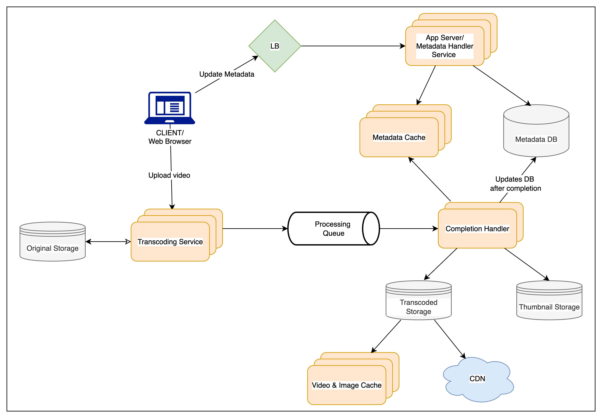

# Youtube

## ✅ 1. Why YouTube?

* YouTube is a **globally popular video-sharing platform**.
* Users can **upload**, **view**, **comment**, **share**, **like/dislike**, and **report** videos.
* It must scale to **billions of users**, handle **massive storage**, and deliver **real-time playback**.

---

## ✅ 2. Goals & Requirements

### 🔧 Functional Requirements

1. **Video Upload**: Users can upload videos.
2. **Video Viewing/Streaming**: Videos should be watchable without noticeable buffering.
3. **Search**: Title-based video search capability.
4. **Engagement**: Track views, likes, dislikes.
5. **Comments**: Users can add and view comments on videos.

### ⚙️ Non-Functional Requirements

1. **High Availability**: Users should be able to access the platform reliably.
2. **High Reliability**: No data (especially videos) should be lost.
3. **Low Latency Playback**: Smooth real-time experience while streaming.

### 🚫 Out of Scope

* Recommendations, subscriptions, watch later, playlists, most viewed, etc.

---

## ✅ 3. Capacity Estimation & Constraints

### 🔢 User & Activity Assumptions

* **Total users**: 1.5 billion
* **DAUs**: 800 million
* **Avg. videos viewed per user/day**: 5
* **Video views per sec**:

  $$
  \frac{800M \times 5}{86400} \approx 46,000 \text{ views/sec}
  $$
* **Upload to view ratio**: 1:200

  $$
  \frac{46K}{200} = 230 \text{ uploads/sec}
  $$

### 💾 Storage Estimates

* **Uploads per minute**: 500 hours of video
* **Avg. storage/minute**: 50MB (due to multiple formats like 240p, 720p, 1080p)
* **Total storage per minute**:

  $$
  500 \times 60 \times 50 = 1,500,000 \text{ MB} = 1500 GB/min = 25 GB/sec
  $$

### 🌐 Bandwidth Estimates

* **Avg. bandwidth for upload**: 10MB/minute
* **Upload bandwidth**:

  $$
  500 \times 60 \times 10 = 300,000 \text{ MB} = 300 GB/min = 5 GB/sec
  $$
* **View bandwidth** (1:200 upload\:view ratio):

  $$
  5 \text{ GB/sec} \times 200 = 1000 GB/sec = 1 TB/sec (outgoing)
  $$

---

## ✅ TL;DR (Quick Revision Card)

| Aspect                    | Value/Detail                                               |
| ------------------------- | ---------------------------------------------------------- |
| DAUs                      | 800 million                                                |
| Views/sec                 | \~46K                                                      |
| Uploads/sec               | \~230                                                      |
| Upload Bandwidth          | 5 GB/sec                                                   |
| View Bandwidth            | 1 TB/sec                                                   |
| Storage per min (500 hrs) | 1.5 TB (25 GB/sec)                                         |
| Functional Features       | Upload, View, Share, Search, Stats, Comments               |
| Non-Functional Goals      | High Availability, High Reliability, Low-latency Streaming |
| Out of Scope              | Rec engine, Watch Later, Channels, Playlists               |

---

## ✅ 4. System APIs

To expose the system's core functionality, we define a set of **RESTful APIs** (could be SOAP as well, but REST is more common for media services).

---

### 📤 `uploadVideo(...)`

#### **Purpose**:

Accepts video content and metadata for upload. The video is **ingested asynchronously** (returns `202 Accepted`), and encoding is handled in the background.

#### **Parameters**:

| Parameter           | Type           | Description                                    |
| ------------------- | -------------- | ---------------------------------------------- |
| `api_dev_key`       | string         | Auth key for rate limiting and throttling      |
| `video_title`       | string         | Title of the video                             |
| `video_description` | string         | Optional text description                      |
| `tags[]`            | array\[string] | For search optimization                        |
| `category_id`       | string         | E.g., Film, Sports, News                       |
| `default_language`  | string         | Video’s language (for localization, filtering) |
| `recording_details` | string         | Optional: GPS or city info                     |
| `video_contents`    | stream         | The raw video file stream                      |

#### **Returns**:

* `HTTP 202 Accepted`
* Video is processed in the background (encoding, replication).
* **Notification mechanism**: Email with playback link on success.
* Optional **status-check API** to track progress of encoding.

---

### 🔍 `searchVideo(...)`

#### **Purpose**:

Perform **search queries** over videos based on title, location, or tags.

#### **Parameters**:

| Parameter                  | Type   | Description                                |
| -------------------------- | ------ | ------------------------------------------ |
| `api_dev_key`              | string | Auth key                                   |
| `search_query`             | string | Free text query                            |
| `user_location`            | string | Optional: personalization or geo relevance |
| `maximum_videos_to_return` | int    | Pagination control                         |
| `page_token`               | string | Pagination offset for next page            |

#### **Returns**:

* JSON object containing a **list of video resources**:

    * Title
    * Thumbnail URL
    * Creation timestamp
    * View count
* Pagination supported via `page_token`.

---

### 📺 `streamVideo(...)`

#### **Purpose**:

Deliver **video chunks** (media stream) from a specific offset, codec, and resolution.

#### **Parameters**:

| Parameter     | Type   | Description                                                    |
| ------------- | ------ | -------------------------------------------------------------- |
| `api_dev_key` | string | Auth key                                                       |
| `video_id`    | string | Unique ID of video                                             |
| `offset`      | number | Seconds from start; supports resume from last watched position |
| `codec`       | string | Helps choose stream encoding (e.g., H.264, VP9)                |
| `resolution`  | string | Helps serve device-specific format (e.g., 1080p, 4K)           |

#### **Returns**:

* A **video stream** (chunked HTTP or HLS/DASH segments)
* Supports features like:

    * **Multi-device resume** (requires server-side offset tracking per user-video)
    * **Adaptive bitrate streaming** (client sends preferred resolution/codec)

---

## ✅ API Design Considerations

| Concern                        | Solution / Note                                                         |
| ------------------------------ | ----------------------------------------------------------------------- |
| **Authentication**             | `api_dev_key` for quota management                                      |
| **Upload latency**             | Asynchronous processing (HTTP 202 + notification)                       |
| **Rate limiting / Throttling** | Based on `api_dev_key`                                                  |
| **Personalization**            | `user_location` can tailor results                                      |
| **Multi-device resume**        | Requires tracking `(user_id, video_id)` with offset, codec, resolution  |
| **Video chunking**             | Use of **HLS/DASH** or **MPEG-DASH** for segmenting video for streaming |

---

## 🧠 TL;DR Flashcard – System APIs

| API           | Method | Key Features                                     |
| ------------- | ------ | ------------------------------------------------ |
| `uploadVideo` | POST   | Async upload, stream input, returns HTTP 202     |
| `searchVideo` | GET    | Supports pagination, search by title/location    |
| `streamVideo` | GET    | Resume playback, adaptive stream, returns stream |

---

## ✅ 5. High-Level Design (HLD)

### 🎯 Goal:

Build a **scalable, fault-tolerant**, and **highly available** video-sharing platform that allows:

* Uploading and encoding videos
* Storing metadata and content
* Streaming content
* Searching, viewing, commenting, and tracking engagement

---

### 🧱 Major Components & Responsibilities

#### 1. **Processing Queue**

* **Why?** Video upload is asynchronous — encoding is resource-intensive and slow.
* **Tech:** Kafka / Amazon SQS / Google PubSub
* **Usage:**

    * When a user uploads a video, a message with metadata (e.g., file location) is placed into the **"Video Processing Queue"**.
    * Multiple worker nodes listen to this queue.

---

#### 2. **Encoder Service**

* **Goal:** Convert videos into multiple formats/resolutions (e.g., 1080p, 720p, 480p, 360p).
* **Why?** Support playback on various devices and networks.
* **Process:**

    * Pull raw video from storage.
    * Transcode into multiple formats using tools like **FFmpeg**.
    * Store encoded versions back in distributed storage.
* **Optimization:** This service should be **stateless** and horizontally scalable (auto-scale based on queue size).

---

#### 3. **Thumbnail Generator**

* **Goal:** Extract representative still images from the video.
* **Why?** Used in search results, recommendations, and video previews.
* **Process:**

    * Pick 3–5 timestamps in video (start, middle, end).
    * Extract and save thumbnails (could use FFmpeg or custom image processing tools).
* **Storage:** Thumbnails are stored in **object storage/CDN** alongside the video.

---

#### 4. **Video and Thumbnail Storage**

* **Goal:** Store large video files and thumbnails durably and reliably.
* **Tech:** AWS S3, GCS, Azure Blob Storage, or in-house distributed file system like HDFS, Ceph.
* **Requirements:**

    * **Durability:** Replicated across regions/zones.
    * **Scalability:** Petabyte-scale, append-only.
    * **Hot/Cold Tiering:** Older or less-watched content may move to cold storage (e.g., Glacier) to reduce cost.
* **Delivery:** Paired with **CDNs** (like CloudFront, Akamai) for fast streaming globally.

---

#### 5. **User Database**

* **Purpose:** Store basic user profile data:

    * `user_id`, `email`, `name`, `password_hash`, `profile_pic`, `joined_on`
* **Tech:** Relational DB like **PostgreSQL**, **MySQL**, or NoSQL like **DynamoDB**.
* **Security:** Use salted password hashing (e.g., bcrypt), token-based auth (e.g., JWT).

---

#### 6. **Video Metadata Storage**

* **Purpose:** Store everything except the actual video:

    * `video_id`, `title`, `description`, `tags`, `upload_time`, `uploaded_by`
    * File paths to different resolutions
    * Stats: `views`, `likes`, `dislikes`, `comments_count`
    * Comments (as embedded or separate table/collection)
* **Search Optimization:** Index `title`, `tags`, and `description` for text search.
* **Suggested Tech:**

    * **Metadata**: Relational DB (e.g., MySQL) or NoSQL (e.g., MongoDB)
    * **Search Indexing**: Elasticsearch or Solr
    * **Comments**: Stored separately in comment DB (denormalized by video\_id)

---

## 🧠 Visual: Component Diagram (Text View)

```plaintext
[ Client Uploads Video ]
        |
        v
  [ API Gateway / Upload API ]
        |
        v
[ Video Storage (Raw Upload) ] --> 
        |
        v
[ Processing Queue (Kafka/SQS) ] --> [ Encoder Service ] --> [ Final Encoded Video Storage (S3/HDFS) ]
                                              |
                                              v
                                    [ Thumbnail Generator ] --> [ Thumbnail Storage (S3/CDN) ]

[ Metadata DB (Video Info, Comments, Stats) ]  <--> [ Search Index (ElasticSearch) ]
[ User DB ]  <--> [ Auth Service ]
```

---

### 🔄 Flow Summary

1. User uploads video via API → Stored temporarily → Message pushed to processing queue.
2. Encoder picks message → Converts to formats → Saves to final storage.
3. Thumbnail Generator extracts thumbnails → Saves to thumbnail storage.
4. Metadata DB updated with video info, paths, user, etc.
5. Users search/watch → Fetch metadata → Stream via CDN.

---

## 🧠 TL;DR Summary Card – HLD

| Component               | Role                                                    |
| ----------------------- | ------------------------------------------------------- |
| Processing Queue        | Async pipeline for encoding, thumbnails                 |
| Encoder                 | Converts video to multiple formats (adaptive streaming) |
| Thumbnail Generator     | Extracts preview images from videos                     |
| Video/Thumbnail Storage | Object storage (S3/HDFS) + CDN                          |
| User DB                 | Stores user profile data                                |
| Metadata DB             | Stores video metadata, comments, stats                  |
| Search Index            | Enables full-text search via titles/tags                |

---

## ✅ 6. Database Schema – YouTube-Like Platform

We’ll use **MySQL (Relational DB)** for structured, relational data like user info, video metadata, and comments. This supports **ACID guarantees**, foreign keys, indexing, and ease of querying relationships.

---

### 📂 A. Video Metadata Schema (`Videos` Table)

| Column Name   | Type      | Description                             |
| ------------- | --------- | --------------------------------------- |
| `video_id`    | BIGINT PK | Unique ID for each video                |
| `title`       | VARCHAR   | Title of the video                      |
| `description` | TEXT      | Description of the video                |
| `size`        | INT       | File size in MB                         |
| `thumbnail`   | VARCHAR   | URL/path to thumbnail in object storage |
| `uploader_id` | BIGINT FK | Foreign key to `Users.user_id`          |
| `views`       | BIGINT    | Total view count                        |
| `likes`       | BIGINT    | Total likes                             |
| `dislikes`    | BIGINT    | Total dislikes                          |
| `created_at`  | DATETIME  | Timestamp of video upload               |

**Indexes:**

* Index on `title`, `uploader_id`, and `created_at` for search/sort operations.
* Full-text index on `title` + `description` for search queries.

---

### 💬 B. Video Comments Schema (`Comments` Table)

| Column Name    | Type      | Description                   |
| -------------- | --------- | ----------------------------- |
| `comment_id`   | BIGINT PK | Unique comment ID             |
| `video_id`     | BIGINT FK | Linked video                  |
| `user_id`      | BIGINT FK | Commenting user               |
| `comment_text` | TEXT      | The actual comment            |
| `created_at`   | DATETIME  | Timestamp of comment creation |

**Relationships:**

* `video_id` → `Videos.video_id`
* `user_id` → `Users.user_id`

**Indexing:**

* Index on `video_id` to quickly fetch comments for a video.

---

### 👤 C. User Schema (`Users` Table)

| Column Name     | Type      | Description                  |
| --------------- | --------- | ---------------------------- |
| `user_id`       | BIGINT PK | Unique ID per user           |
| `name`          | VARCHAR   | Name of the user             |
| `email`         | VARCHAR   | Unique and indexed for login |
| `address`       | VARCHAR   | Optional                     |
| `age`           | INT       | Optional                     |
| `registered_on` | DATETIME  | User account creation time   |

**Security Enhancements (in real systems):**

* Store `password_hash`, `salt`
* Add `last_login`, `account_status`, `roles` for user management

---

### 🧩 Entity Relationship Diagram (Text-Based)

```plaintext
 Users
 -------
 user_id (PK)
 name
 email
 ...

 Videos
 -------
 video_id (PK)
 title
 description
 uploader_id (FK -> Users.user_id)
 thumbnail
 views, likes, dislikes
 ...

 Comments
 --------
 comment_id (PK)
 video_id (FK -> Videos.video_id)
 user_id (FK -> Users.user_id)
 comment_text
 ...
```

---

### 🛠 Schema Optimization Tips (Interview Value)

* **Denormalization**:

    * Frequently accessed counters (`views`, `likes`) are stored in `Videos` table instead of a separate analytics table.
    * To avoid write bottlenecks (e.g., hot rows for popular videos), consider **event queues** to batch update counts.

* **Sharding Strategy (if scale increases)**:

    * Shard `Videos` and `Comments` tables by `video_id` (hash/modulo).
    * Use UUIDs or Snowflake IDs for `video_id`, `user_id` to support distributed generation.

* **Caching**:

    * Use Redis to cache:

        * Video metadata
        * Top N comments
        * View counts

---

### 📦 Sample SQL Table Definitions

```sql
CREATE TABLE Users (
    user_id BIGINT PRIMARY KEY,
    name VARCHAR(100),
    email VARCHAR(255) UNIQUE,
    address VARCHAR(255),
    age INT,
    registered_on DATETIME
);

CREATE TABLE Videos (
    video_id BIGINT PRIMARY KEY,
    title VARCHAR(255),
    description TEXT,
    size INT,
    thumbnail VARCHAR(255),
    uploader_id BIGINT,
    views BIGINT DEFAULT 0,
    likes BIGINT DEFAULT 0,
    dislikes BIGINT DEFAULT 0,
    created_at DATETIME,
    FOREIGN KEY (uploader_id) REFERENCES Users(user_id)
);

CREATE TABLE Comments (
    comment_id BIGINT PRIMARY KEY,
    video_id BIGINT,
    user_id BIGINT,
    comment_text TEXT,
    created_at DATETIME,
    FOREIGN KEY (video_id) REFERENCES Videos(video_id),
    FOREIGN KEY (user_id) REFERENCES Users(user_id)
);
```

---

## 🧠 TL;DR Summary Card – Database Schema

| Table    | Key Fields                          | Notes                        |
| -------- | ----------------------------------- | ---------------------------- |
| Users    | `user_id`, `email`, `registered_on` | User profiles                |
| Videos   | `video_id`, `uploader_id`, `views`  | Metadata + stats             |
| Comments | `comment_id`, `video_id`, `user_id` | Indexed for video-wise fetch |

---

## ✅ 7. Detailed Component Design – YouTube System

---

### 🔁 **Traffic Pattern Overview**

* **Read-heavy system**:
  `Read : Write = 200 : 1`
  ⇒ Prioritize *low-latency reads*, *high throughput*, and *caching strategies*.

---

### 🗃️ 1. **Video Storage (Write Path)**

| Aspect             | Design Choice                                                                        |
| ------------------ | ------------------------------------------------------------------------------------ |
| **Storage System** | Use **Distributed File Systems** like **HDFS**, **GlusterFS**, **Amazon S3**, or GFS |
| **Why?**           | - Supports large file storage                                                        |

* Redundancy, fault-tolerance
* Horizontal scalability |
  \| **Upload Strategy** | Chunked uploads using resumable protocol (e.g., tus.io, HTTP/2 + range headers) |
  \| **Failure Resilience** | Upload checkpoints saved in metadata DB or blob storage to allow *resuming from same byte offset* |

---

### 🧪 2. **Video Processing Pipeline**

| Step | Component               | Description                                                                          |
| ---- | ----------------------- | ------------------------------------------------------------------------------------ |
| 1    | **Upload Handler**      | Accepts raw video stream, stores in blob FS                                          |
| 2    | **Processing Queue**    | Message queue (e.g., Kafka, SQS) to decouple upload from processing                  |
| 3    | **Encoder Workers**     | Encodes video into multiple resolutions/codecs (360p, 720p, 1080p, H.264, VP9, etc.) |
| 4    | **Thumbnail Generator** | Extracts 3–5 representative frames as thumbnails                                     |
| 5    | **CDN Uploader**        | Pushes final encoded chunks and thumbnails to CDN-backed object storage              |
| 6    | **Metadata Update**     | Updates video status, formats available, and thumbnail links in DB                   |
| 7    | **Notifier**            | Email/webhook to notify uploader of video availability                               |

---

### 🌍 3. **Read Optimization – Video Streaming**

| Feature                       | Strategy                                                                             |
| ----------------------------- | ------------------------------------------------------------------------------------ |
| **Segregation of read/write** | Use **dedicated read replicas** for serving video metadata queries                   |
| **Streaming Strategy**        | Video chunks (MPEG-DASH or HLS format) streamed via CDN with byte-range support      |
| **Offset Support**            | Maintain playback offset per `user_id + video_id` in a separate DB or Redis          |
| **CDN Use**                   | Front video chunks with CDN (e.g., Akamai, Cloudflare, CloudFront) to reduce latency |
| **Multi-device Support**      | Clients send `offset`, `codec`, and `resolution` to fetch the correct stream chunk   |

---

### 🖼️ 4. **Thumbnail Storage**

| Consideration                                                     | Design                                       |
| ----------------------------------------------------------------- | -------------------------------------------- |
| **Small file size**                                               | Typically \~5KB per thumbnail                |
| **High read frequency**                                           | One page can request 20+ thumbnails at once  |
| **Storage Options**                                               | ❌ Disk: High seek latency                    |
| ✅ **Bigtable**, Cassandra, or S3 + CDN for high-throughput access |                                              |
| **Cache Strategy**                                                | - Use **Redis/Memcached** for hot thumbnails |

* Use CDN edge caching (small TTL or preloading) |
  \| **Serving Strategy** | Load thumbnails asynchronously in parallel to reduce page load time |

---

### 🔁 5. **Handling Staleness in Metadata**

| Component               | Design                                                                                 |
| ----------------------- | -------------------------------------------------------------------------------------- |
| **DB replication**      | Use **Master-Slave** architecture (MySQL Replication)                                  |
| **Write Path**          | All video metadata writes go to master                                                 |
| **Read Path**           | Reads served from slaves (cached copies)                                               |
| **Staleness Trade-off** | Acceptable delay of a few milliseconds (eventual consistency)                          |
| **Alternate Option**    | Use **change data capture (CDC)** + **eventual update via queues** for search indexing |

---

### 🧩 Supporting Subsystems

#### A. **Metadata Caching**

* Cache recently watched video metadata, trending videos, thumbnails
* Use Redis with LRU eviction
* Cache key: `video_id`, `uploader_id`, `category`

#### B. **User Preferences / Watch History**

* Store in NoSQL or Redis (per-user key → list of watched video IDs)
* Used for personalized feed generation

#### C. **Encoding Formats Store**

* Maintain a mapping of:

  ```
  video_id → [360p_H264_url, 720p_H264_url, 1080p_VP9_url]
  ```

---

## 📊 Visual Component Flow

```
User Uploads Video
     ↓
Upload Service (chunked, resumable)
     ↓
Blob Storage (raw file)
     ↓
⏳ Processing Queue (Kafka/SQS)
     ↓
[Encoder] → [Thumbnail Generator]
     ↓                    ↓
Encoded Video     →   Thumbnails
     ↓                    ↓
Object Store + CDN   Object Store + CDN
     ↓                    ↓
Metadata DB (Update status, paths)
     ↓
Notifier Service (email / webhook)

User Requests Video → CDN → Streams video chunk
```

---

## 🧠 TL;DR: Interview Summary Card

| Component            | Design Strategy                                                             |
| -------------------- | --------------------------------------------------------------------------- |
| Video Storage        | HDFS / GlusterFS / S3 for large files; chunked uploads; resumable uploads   |
| Encoding Pipeline    | Queue-based async processing → multi-format encoding → thumbnail generation |
| Read Scaling         | Master-slave DB replication, CDN-backed video chunk serving                 |
| Thumbnail System     | Stored in Bigtable/Cassandra; heavily cached in Redis + CDN                 |
| Metadata Consistency | Slight staleness tolerated; eventual consistency via replication            |

---

## ✅ 8. Metadata Sharding – Designing for Scalability

---

### 🔍 **Why Shard Metadata?**

* Millions of videos uploaded, viewed, and commented on daily.
* Metadata DB (MySQL or similar) needs to **scale horizontally** to handle:

    * High **read throughput** (200:1 read-to-write ratio)
    * Constant **writes** (uploads, likes, views, comments)
* **Goal**: Spread load **evenly** across servers while ensuring **fast lookup** and **no bottlenecks**.

---

### ⚙️ Sharding Strategies Explored

#### 📌 **1. Sharding by `UserID`**

| ✅ Pros                                                               | ❌ Cons                                                       |
| -------------------------------------------------------------------- | ------------------------------------------------------------ |
| Efficient to fetch **all videos of a user** (localized in one shard) | **Hotspot** if user becomes famous (e.g., celebrity/creator) |
| Simple hash(`UserID`) → DB                                           | Difficult to **rebalance** as user's video count grows       |
| Good write locality (for uploads)                                    | **Skewed distribution** over time → some shards overloaded   |

**Conclusion**:

* Good for smaller systems or early-stage products.
* Risky at scale due to **uneven popularity growth**.

---

#### 📌 **2. Sharding by `VideoID`**

| ✅ Pros                                                       | ❌ Cons                                                             |
| ------------------------------------------------------------ | ------------------------------------------------------------------ |
| Distributes **popular users' videos across multiple shards** | To find *all videos by a user*, need to query **all shards**       |
| Better for **load balancing**                                | **High latency** for user feed queries unless indexed/cache-backed |
| Easier to cache hot videos independently                     | Query fan-out for search by title or user-based filters            |

**Conclusion**:

* **Better scalability and distribution**.
* Can be optimized using **secondary indexes or caching layers**.

---

### 🔁 **Sharding Evolution & Mitigations**

#### 🎯 Problem: **Hot Users** (with UserID sharding)

* Their data becomes a single-shard bottleneck.
* Solution:

    * **Re-shard** or use **consistent hashing**
    * Or split into **user + bucket** (e.g., `UserID + Mod 10`)

#### 🎯 Problem: **Popular Videos** (with VideoID sharding)

* Frequently accessed from one shard.
* Solution:

    * Add **caching layer** for hot metadata (e.g., Redis)
    * Serve **likes/views** from a high-throughput counter system (e.g., Redis + periodic DB flush)

---

### 📦 **Sharding + Caching Architecture**

```
+--------------------------+
|       Frontend API       |
+--------------------------+
           ↓
+--------------------------+        +-----------------------------+
|       Metadata Cache      |<----->|  Redis / Memcached (hot data) |
+--------------------------+        +-----------------------------+
           ↓
+--------------------------+
|   Metadata Router Layer   | ← applies sharding logic
+--------------------------+
      ↓        ↓        ↓
+---------+ +---------+ +---------+
| Shard 1 | | Shard 2 | | Shard 3 | ... MySQL/Postgres nodes
+---------+ +---------+ +---------+
```

---

### ⚖️ Final Recommendation – Hybrid Approach

| Component            | Strategy                                                                   |
| -------------------- | -------------------------------------------------------------------------- |
| Video Metadata       | **Shard by `VideoID`** → good distribution                                 |
| User Feed/Video List | Build **secondary index** `UserID → [VideoIDs]` in NoSQL (e.g., Cassandra) |
| Search by Title      | Maintain a **search index** using Elasticsearch or Solr                    |
| Caching Layer        | Use Redis/Memcached for **popular video metadata, feeds**                  |
| Resharding Support   | Use **consistent hashing** to allow easier server addition/removal         |

---

### 🧠 TL;DR: Interview Summary Card

| Point            | Summary                                                                           |
| ---------------- | --------------------------------------------------------------------------------- |
| Why shard?       | Handle scale of reads/writes, distribute load                                     |
| UserID sharding  | Good for per-user access, but leads to hotspots                                   |
| VideoID sharding | Better distribution, but needs fan-out for user-based queries                     |
| Recommended      | Shard by `VideoID` + secondary index on `UserID`                                  |
| Tools            | Redis (caching), Consistent Hashing, Cassandra/Bigtable (index), Elastic (search) |

---

## ✅ 9. Video Deduplication – Saving Space, Bandwidth, and Time

---

### 🚨 Why Deduplication is Crucial

As millions of users upload content, **duplicate videos** quickly become a **serious problem** for system performance, cost, and user experience.

#### 🔁 Common Types of Duplicates

* Same video re-uploaded by different users.
* Slight variations: different resolutions, aspect ratios, borders, subtitles.
* Clips/cuts/excerpts of larger videos.

---

### 📉 Impacts of Duplication

| Layer      | Problem                                                           |
| ---------- | ----------------------------------------------------------------- |
| 🧠 Storage | Redundant data consumes disk, increases costs                     |
| ⚡ Cache    | Lower hit ratio → more latency and memory usage                   |
| 🌐 Network | Bandwidth wasted pushing the same content again                   |
| 🔋 Energy  | Increased energy usage due to storage/network/compute duplication |
| 👤 User    | Slower video loads, noisy search results, poor experience         |

---

### ✅ Deduplication Strategy

#### 🎯 When?

**As early as possible** — ideally during the **upload process**, not as a background batch job.

#### 🎬 Where?

* In the **upload pipeline**, right before encoding or storage.
* Acts as a **gatekeeper** to stop or optimize further video processing.

---

### 🧠 How Does It Work?

#### 📍 Step-by-Step Flow

1. **User starts uploading a video.**
2. System extracts **signature** (aka “fingerprint”) from video chunks:

    * Use visual/audio hashing, perceptual features.
3. **Compare** signature with existing video DB:

    * Techniques:

        * **Block Matching**
        * **Phase Correlation**
        * **Perceptual Hashing (pHash)**
        * **Scene Cut Detection**
4. Depending on the match:

    * ✅ If **exact duplicate** → stop upload, reuse stored copy.
    * ⬆️ If **new version is higher quality** → keep new one.
    * ✂️ If **partial overlap** → upload only missing chunks.

---

### 🔍 Video Matching Techniques

| Technique             | Purpose                                            |
| --------------------- | -------------------------------------------------- |
| 🧱 Block Matching     | Compare macroblocks visually                       |
| 🔄 Phase Correlation  | Frequency-domain matching, detects shifts          |
| 📷 Perceptual Hashing | Create unique signature from visual/audio features |
| 🎞 Scene Detection    | Useful to detect excerpt vs full version           |
| 🧩 Chunking + SHA     | Efficient for exact binary duplicates              |

---

### 📦 Architecture Sketch

```
+--------------------+
|   Upload Service   |
+--------------------+
          ↓
+------------------------+
|  Deduplication Engine  | ← Compares signature
| (Hashing + Matching)   |
+------------------------+
   ↓ Match         ↓ No Match
[Reuse Video]   [Store New Video]
                   ↓
          +-----------------+
          | Encode + Store  |
          +-----------------+
```

---

### 💡 Optimization Ideas

* Store video in **chunks** (e.g., 10s segments) → avoid uploading full videos again.
* Maintain **fingerprint DB** (e.g., in Cassandra or a hash index).
* Support for **fuzzy matches** to allow minor differences.
* Allow **reference counting** for shared videos among users.

---

### 🧠 TL;DR: Interview Summary Card

| Concept              | Summary                                                                    |
| -------------------- | -------------------------------------------------------------------------- |
| Goal                 | Save storage, bandwidth, and improve performance by avoiding duplicates    |
| When                 | Inline (during upload)                                                     |
| How                  | Generate perceptual hashes/chunks and compare to existing video signatures |
| Tools                | Block Matching, Phase Correlation, pHash                                   |
| What to do on match? | Reuse, replace, or upload missing parts only                               |
| Benefit              | Lower infra cost, faster uploads, better UX                                |

---

## ✅ 10. Load Balancing – Serving Videos Efficiently at Scale

---

### 🎯 Why Load Balancing Is Critical

In a video-sharing platform:

* Video requests are **read-heavy**.
* **Popularity is skewed** — few videos go viral and attract disproportionate traffic.
* Without smart distribution, **some servers will get overwhelmed**, leading to failures, buffering, or latency.

---

### 🧩 Load Balancing Strategy Components

#### 1. **Consistent Hashing for Caching Layer**

* Cache servers (e.g., Memcached or CDN edge servers) use **consistent hashing** to assign videos to servers.
* This ensures minimal data reshuffling when a server is added/removed.

##### 🔁 Problem:

Hashing based solely on video ID can cause **hotspotting** if a particular video becomes popular.

> 📌 Popular videos → overload the physical machine that owns the hash slot → **performance bottleneck**.

---

#### 2. **Dynamic HTTP Redirection for Local Balancing**

If a server becomes **overloaded**, it can **redirect** the client to a nearby underloaded server.

* 🧠 Redirection happens **within the same data center or region**.
* Ensures load distribution even when hot videos skew the hash-based load.

##### 🔄 Pros:

* Quick adaptation to traffic surges.
* Reduces cache server overload.

##### ⚠️ Cons:

| Problem                        | Impact                                                       |
| ------------------------------ | ------------------------------------------------------------ |
| 🔁 Multiple redirections       | Slower start-up, more network hops                           |
| 🌐 Inter-data-center redirects | May lead user to a **distant cache**, increasing **latency** |
| 🕰 Extra HTTP request          | Increases time-to-first-byte (TTFB)                          |

---

### 📦 Tiered Cache Architecture

```
                    +------------------+
                    |  Client Browser  |
                    +------------------+
                             ↓
                   +----------------------+
                   |   Local Cache Tier   |  ← Consistent Hashing
                   +----------------------+
                        ↓          ↓
            [Load Normal]     [Overloaded]
                ↓                 ↓
       Serve Video         → HTTP Redirect
                               ↓
                   +----------------------+
                   |  Nearby Local Cache  |
                   +----------------------+
                             ↓
                   [Still Busy? Redirect to]
                             ↓
                    +-------------------+
                    |  Regional Cache   |  ← Higher Tier
                    +-------------------+
```

---

### 🧠 Interview Highlights – TL;DR Card

| Concept       | Summary                                                                    |
| ------------- | -------------------------------------------------------------------------- |
| Technique     | Consistent Hashing + Dynamic HTTP Redirection                              |
| Issue         | Popular videos overload the assigned cache server                          |
| Local Fix     | Redirect to another server in same location                                |
| Global Backup | Higher-tier regional cache redirection                                     |
| Trade-Offs    | Extra HTTP requests, startup delay, latency if redirected to distant cache |
| Goal          | Fast video starts, even load distribution, and fault tolerance             |

---

### ✅ Optimization Suggestions

1. **Replication of Hot Content**

    * Replicate highly popular videos across multiple cache nodes proactively.

2. **Popularity-Aware Caching**

    * Adjust caching strategy based on view count heatmaps.

3. **Adaptive Hashing**

    * Instead of static consistent hashing, use **virtual nodes** weighted by server capacity or popularity.

4. **Prefetching Nearby Segments**

    * Prefetch adjacent video chunks based on trending patterns to reduce mid-stream buffering.

---

## ✅ 11. Caching Strategy – Speeding Up a Global Video Platform

---

### 🎯 Why Caching Is Critical

A video-sharing service like YouTube needs to:

* Serve **billions of views daily** across the globe.
* Minimize **latency** for video playback and metadata access.
* Prevent **backend overload** on metadata and video storage systems.

Caching solves all of these — but needs careful design for scalability, efficiency, and cost.

---

## 🔁 1. Video Caching (CDN/Edge Layer)

### 🌍 Global Distribution

* Use **geo-distributed video cache servers** (like a CDN) to **push videos closer to users**.
* This reduces buffering and startup latency by minimizing cross-region hops.

### 🧠 Smart Video Caching – 80/20 Rule

* Only a small portion of videos are **extremely popular**.
* Using the **Pareto principle** (80/20):

    * 20% of videos generate 80% of traffic.
    * Cache this **hot subset** aggressively at edge locations.

#### 🔧 Implementation

* Store frequently accessed video segments (not whole videos) at CDN edge.
* Use popularity-based LRU or LFU cache eviction.
* Optionally replicate viral videos in all PoPs (Point of Presence) globally.

---

## 🧾 2. Metadata Caching (e.g., title, likes, views, user info)

### ⚙️ Cache Layer with Memcached/Redis

* Application servers first **check cache (e.g., Memcached)** for metadata.
* If a cache miss occurs → fallback to master-slave **MySQL** databases.
* LRU cache eviction removes least recently used rows, making room for fresher metadata.

### ✅ Advantages

| Benefit                     | Impact                                            |
| --------------------------- | ------------------------------------------------- |
| ⚡ Fast metadata retrieval   | Faster page load, thumbnails, likes/views display |
| 🔁 Reduces DB hits          | Less load on SQL backends                         |
| 📈 Scales well with traffic | Handles read-heavy nature of service efficiently  |

---

### 🧠 Smart Caching for Metadata

Instead of caching **every row**, be selective and **cache intelligently**:

#### 1. **Popularity-Based Metadata Caching**

* Track view count or access frequency.
* Only cache metadata for:

    * Top trending videos
    * Most searched titles
    * Popular users/channels

#### 2. **Time-Based Expiry**

* Set TTL (time-to-live) for non-critical metadata (e.g., comments).
* Hot metadata (views/likes) can have longer TTL or be refreshed on access.

#### 3. **Write-Through or Write-Back Caching**

* If a user likes a video, we can:

    * **Write-through:** Update cache and DB instantly.
    * **Write-back:** Update cache immediately, batch write to DB later (with TTL/expiry).

---

### ⚖️ Trade-Offs to Consider

| Trade-Off            | Explanation                                                                                      |
| -------------------- | ------------------------------------------------------------------------------------------------ |
| ❄️ Cold Start        | New videos not yet cached will have high latency. Solution: pre-warm cache for trending content. |
| 🧹 Eviction Policy   | LRU is simple but may remove rising trends. Hybrid LFU+LRU is better for dynamic popularity.     |
| 💾 Cache Size Limits | Edge caches are memory-limited. Prioritize video **segments** over full content.                 |

---

## 🔄 Cache Layer Workflow

```
         User Request
               ↓
        [App Server/API Gateway]
               ↓
     ┌────────────────────────────---------------┐
     │      Metadata Cache (Redis/Memcached)     │
     └────────────────────────────---------------┘
         ↓         ↓
     [Cache Hit]   [Cache Miss]
         ↓             ↓
      Serve        Query DB (MySQL)
       ↓              ↓
  Return Response    Update Cache
```

---

## 🧠 TL;DR Interview Summary

| Topic            | Summary                                                    |
| ---------------- | ---------------------------------------------------------- |
| Edge Caching     | Use CDN-style geo-distributed caches for videos            |
| Metadata Caching | Use Memcache/Redis in app layer to reduce DB load          |
| Caching Strategy | 80/20 rule – cache hot content                             |
| Eviction Policy  | LRU for metadata, LFU+LRU hybrid for dynamic access        |
| Write Handling   | Write-through or write-back depending on consistency needs |

---

## ✅ 12. Content Delivery Network (CDN) – Fast Global Video Streaming

---

### 📦 What Is a CDN?

A **Content Delivery Network** is a **network of geographically distributed edge servers** designed to deliver content (videos, images, static assets) with **minimal latency** to end users.

Think of CDNs as **“video delivery accelerators”** that sit **closer to users** than the origin servers.

---

### 📍 How CDN Improves YouTube-like Performance

| Benefit                  | Description                                                              |
| ------------------------ | ------------------------------------------------------------------------ |
| 🌐 Proximity to Users    | CDNs store video closer to users → fewer network hops → faster load time |
| 🚀 Low Latency Streaming | Reduced buffering and startup delay for high-traffic videos              |
| 📊 Scalable Load         | Offloads request volume from origin video storage servers                |
| 💾 In-Memory Serving     | Popular video segments can be cached and served directly from RAM        |

---

### 🧠 CDN Strategy for Our Service

#### 🌟 Popular Videos → Move to CDN

* Videos with **high view counts (e.g., >100/day)** are replicated across CDN edge nodes.
* This helps absorb **viral traffic** and ensures excellent QoS (Quality of Service).

#### 💤 Less Popular Videos → Origin Data Centers

* Videos with **low access frequency (e.g., <20 views/day)** are **not pre-cached** in CDN.
* These are fetched from **regional data centers or backend video storage** when requested.

---

### 📈 Resulting Benefits

* **Highly cost-efficient:** No need to store all content on CDN (storage is expensive).
* **Balanced user experience:** Popular content loads fast; long-tail content still accessible.
* **Dynamic scalability:** CDN helps absorb traffic spikes without origin overload.

---

## ✅ 13. Fault Tolerance – Resilience at Scale

---

### ⚠️ Why Fault Tolerance Matters

A global-scale video service can’t afford downtime. Possible failure points:

* Video storage node goes down
* Database server crash
* Cache node becomes unreachable
* CDN region fails

The system must **degrade gracefully and self-heal** without impacting users.

---

### 🛠️ Fault Tolerance Strategies

#### ✅ 1. **Consistent Hashing**

* Used to distribute load across **database/storage/cache nodes**.
* When a node fails or is added, only a **small fraction of keys** need to be remapped.
* Avoids complete rehashing, enabling fast recovery and scaling.

> Example: When a DB shard crashes, consistent hashing remaps only nearby keys to adjacent nodes.

#### 🔄 2. **Replication**

* Store **replicas** of metadata and videos across multiple zones/data centers.
* If one region fails, redirect requests to the **nearest healthy region**.

#### 📦 3. **Redundant CDN Copies**

* CDN edge servers replicate videos across **multiple PoPs** (Points of Presence).
* If one CDN node fails, client can auto-fallback to another nearby cache node.

#### 🧠 4. **Health Monitoring & Failover**

* Use **heartbeats** to monitor node health.
* Automatically reroute traffic if a cache/database/video server becomes unhealthy.

---

### 🧠 TL;DR Interview Recap

| Topic            | CDN                                       | Fault Tolerance                        |
| ---------------- | ----------------------------------------- | -------------------------------------- |
| Purpose          | Serve videos closer to users              | Keep service running despite failures  |
| Strategy         | Cache popular videos on edge nodes        | Use consistent hashing + replication   |
| Edge Caching     | Hot content replicated globally           | Redundant PoPs handle failures         |
| Backend Fallback | Rarely accessed videos served from origin | Auto reroute to healthy zones/replicas |

---

