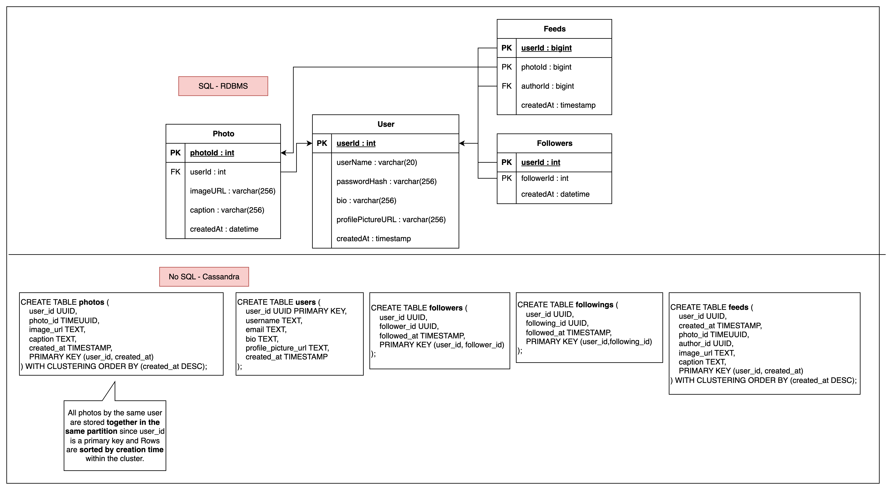
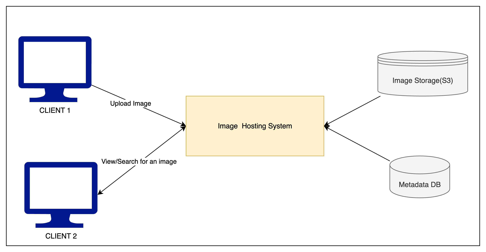

# Instagram LLD

### 1. Requirements
**Functional Requirements**
- Users should be able to upload/download/view photos. 
- The system should be able to generate and display a user’s News Feed consisting of top photos
  from all the people the user follows.
- Users can follow other users.
- Users can perform searches based on photo/video titles. 

**Non-functional Requirements**
- Our service needs to be **highly available**.
- Consistency can take a hit (in the interest of availability), if a user doesn’t see a photo for a
  while; it should be fine.
- The acceptable **latency** of the system is 200ms for News Feed generation.
- The system should be highly **reliable**; any uploaded photo or video should never be lost.

### 2. Capacity Estimation and Constraints
**Assumptions**
- 10M total users. DAU=10% -> 1M
- Each user uploads 2 photos daily.
- Size of a photo can be **200KB** approx

**Storage Estimate:** (This is object storage estimate)
- Storage required for 1 day = 1M*2*200KB=400GB
- Storage required for 10 years = 400GB*365*10 = 1460000GB ~ 1.46PB

### 3. API Design
- POST - /api/v1/postFeed {userId, photo(Multipart file), caption}
- GET - /api/v1/getFeed {userId}
- GET - /api/v1/follow {follower, followee}
- GET - /api/v1/getProfile {userId}

### 4. Database Schema

- We can store photos in Amazon S3. And store the link to it in the meta data DB
- We can use both RDBMS or cassandra.
- If we want to find all the photos posted by one user
  - In RDBMS approach, we need to join USer and photo table and query for the given user
  - In NoSQL approach, while table creation itself we need to create such a way that it servers for this purpose. We need to give partition key as userId in Photos table so that the table got partitioned based on the users and all the photos posted by a single user will be available in one cluster. And this design can be easily scaled.
- If we want to find the followers and following list of a particular user,
  - In RDBMS, We can have one table Followers and for followers we need to query for userId=x and for following we need to query for followerId=x to get x's following list
  - In NoSQl, Since db is horizontally scaled based on partition key we can't make sure that we geting all x's following if we query for follower_id=x. So we need to maintain two tables for followers and following table with partition key as their respective userIds. So for a single user following will be available in one cluster in this design.
- We need to analyse pros and cons of sql and no-sql and make use of them to our advantage for our usecase.

**Data Size Estimation**
- Assuming int and datetime takes 4 bytes
- User table
  - Total storage for 1 row => userID(4)+userName(20)+passwordHash(256)+bio(256)+profilePictureURL(256)+createdAt(4)=794Bytes
  - Total storage for 10M users(10M row) => 794*10M => 7940MB ~ **8GB**
- Photo table
  - Total storage for 1 row => photoId(4)+userId(4)+imageURL(256)+caption(256)+createdAt(4)=>524 bytes
  - If each DAU(1M) uploads 2 photos daily, daily 2M photos are uploaded.
    - Total storage required for 1 day = 524*2M = 1088MB ~ 1.1GB per day
    - Total storage required for 10 years = 1.1GB*365*10 ~ 4015GB ~ **4.1TB**
- Followers table
  - Total storage for 1 row => userId(4)+followerId(4)+createdAt(4)=12B
  - Let us assume one user follows 500 users avg
    - Total storage required for 500M users = 500M*500*12 = 3000000MB ~ **3 TB**
- Total space required = 8GB+4.1TB+3TB=7.1TB+8GB (7,100,000,000,000+8,000,000,000=7108GB) ~ 7.2TB

### 5. High Level System Design

- We need to cover 2 flows
  - To upload image
  - To View image

### 6. Component Design
- Writes are slow process and reads are faster. 
- Servers can hold only limited concurrent connections(say 500). As writes are slow, it may hold the connections for longer time and let the read requests starve.
- And this monolithic approach is hard to scale independently and it also violates the **single responsibility** design principle.
- Adapting microservice architecture and separating each request to each service solves the problem. Now they can be scaled independently.

### 7. Reliability and Redundancy
- Our non functional requirement includes high reliability, availability and low latency.
- **Reliability** is basically losing data. We can **replicate our storages** to avoid this problem.
- **High availability** can be achieved if we have **multiple replicas of services** load balanced and running and serving requests. If even some servers die down, system will not be down making the system highly available.
- Redundancy avoids single point of failure(SPOF) as well.
- We can also have **standby servers** not getting any traffic until and unless primary server dies down.

### 8. Data Sharding (RDBMS Sharding Strategies)
- Different strategies to shard Photos table
- Partitioning by UserID
  - shard key = userId % n where n is number of shards
  - All photos of a user live on the same shard.
  - Each shard has its own auto-incrementing PhotoID sequence. To make PhotoIDs globally unique, we can store photoID as _ShardID + LocalPhotoID_
  - Challenges:
    - **Hot users overload** their shard with high read and writes
    - **Uneven** data growth and **distribution** of data across shards. Some users may have many more photos and some users have few.
    - A **single shard may not fit all data** for a very active user.
    - If the shard is down, all user's data is unavailable(we can use replication to mitigate this). If the shard is overloaded, response will have high latency
- Partitioning by PhotoID
  - Pre-generate a unique PhotoID first and shard key as _PhotoID % N_
  - All photos evenly distributed across shards and no need to append shardId with photoID.
  - Advantages : 
    - Avoids hot users overloading single shards.
    - Uniform distribution of writes and storage.
    - No per-shard capacity limits for any user.
  - Challenge
    - we need to generate PhotoID before knowing the shard. we cannot use auto-increment in each shard.
    - We can following strategies to mitigate this issue:
      - Dedicated DB to generate IDs like a Key Generation service(KGS).
        - It may lead to SPOF. To mitigate it, we can have 2 DBs
          - One generating even and other generating odd IDs.
      - Have **UUID** and hash%n it to determine the shard
  - In this approach, User’s photos spread across shards. So we need a lookup table containing mapping of (userId, photoID).
    - We need to fetch all photo ID's of the user.
    - And we need to query each shard to get photo related details. We can concurrently query all the shards and aggregate the results.
- How to plan for future scaling?
  - Define many logical partitions up front.
    - Logical Partition is a namespace for a subset of rows, that can later be moved, split, or reassigned to different physical storage. 
    - We can logically partition our photos DB based on (createdAt timestamp range)
  - At first, multiple logical partitions can live on the same physical DB server. 
  - Later, move logical partitions to new servers as data grows. 
  - Maintain a config file or mapping table: {LogicalPartition -> PhysicalServer} which tells which logical partition resides in which physical server.
  - Rebalance by updating the config mapping.

**Cassandra privileges:**
- Cassandra provides scaling, rebalancing and replicating features if we select correct partition key
- It uses **consistent hashing** to do above mentioned features.
- Challenges:
  - Poor partition keys can backfire every advantage. So Time bucketing or adding randomness is often needed.
  - It does not automatically handle time-based compaction or TTL policies. We need to delete or have expiration strategies of old data.
  - If we need to query by fields that are not part of the partition key, we need to maintain a separate table denormalized or use  **materialized views.**
  - It does not “join” tables.
  - It does not enforce strict ACID transactions across partitions. Because it is designed for **eventual consistency**.